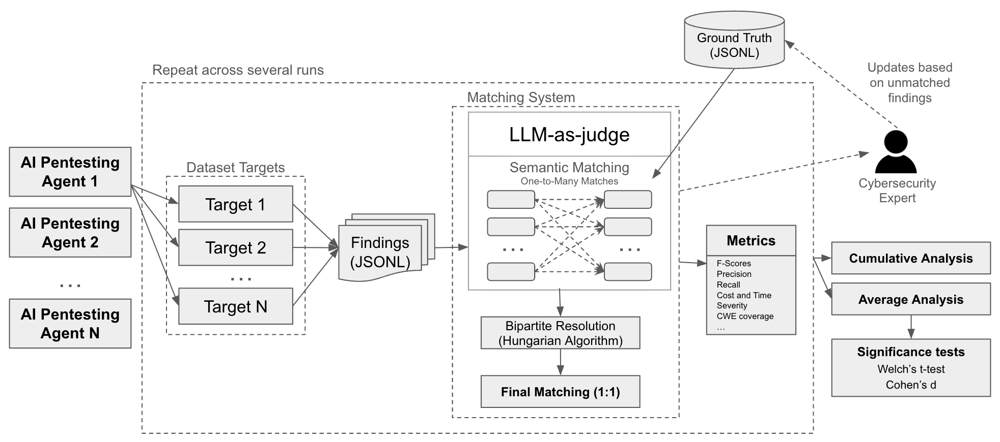

<a name="readme-top"></a>
<div align="center">

<h1>
  <br>
    
    <br><br>
    EthiBench
    <br><br>
</h1>

<a href="https://arxiv.org/abs/2605.10834"></a>

</div>

## From Controlled to the Wild: Evaluation of Pentesting Agents for the Real-World

<p align="center">
  
</p>

AI pentesting agents are increasingly credible as offensive security systems, but current benchmarks still provide limited guidance on which systems will perform best on real-world targets. Most existing evaluations assess and optimize for predefined goals such as flag capture, remote code execution, exploit reproduction, or trajectory similarity, in simplified or narrow settings. These benchmarks are valuable for measuring bounded capabilities, yet they do not adequately capture the complexity, open-ended exploration, and strategic decision-making required in realistic pentesting. We present a practical evaluation framework that shifts assessment from task completion to validated vulnerability discovery, allowing evaluation in sufficiently complex targets spanning multiple attack surfaces and vulnerability classes. The framework combines structured ground-truth with LLM-based semantic matching to identify vulnerabilities, bipartite resolution to score findings under realistic ambiguity, continuous ground-truth maintenance, repeated and cumulative evaluation of stochastic agents, efficiency metrics, and reduced-suite selection for sustainable experimentation.

This repository contains the code for the proposed **adaptable evaluation protocol** — not a static benchmark. You can bring your own targets, agents, and findings; EthiBench handles the matching and scoring. However, we also provide **108 expert-annotated ground-truth entries** (in [`examples/gt/`](examples/gt/)) for three open-source targets, that you can evaluate your agents on:

| Target | GT Entries | Repository |
|--------|-----------|------------|
| **vuln-bank** | 60 | [Commando-X/vuln-bank](https://github.com/Commando-X/vuln-bank) |
| **paygoat** | 28 | [stuxctf/PAYGoat](https://github.com/stuxctf/PAYGoat) |
| **xben-090** | 20 | [xbow-engineering/validation-benchmarks (XBEN-090)](https://github.com/xbow-engineering/validation-benchmarks/tree/main/benchmarks/XBEN-090-24) |

## Installation

```bash
poetry install
```

Requires Python 3.11+ and Poetry installed.

## Quick Start

```bash
# 1. Set your LLM API key
export OPENAI_API_KEY="..."

# 2. Run evaluation
ethibench evaluate ./my_experiment --dataset path/to/dataset.yaml

# 3. View results
cat ./my_experiment/evaluation_outputs/summary.md
```

## Demo: Evaluating with the Included Targets

This walkthrough shows how to evaluate an agent's findings against the three open-source targets shipped with EthiBench.

### 1. Run your agent against the targets

Deploy the targets locally (e.g. via Docker) and point your pentesting agent at them. Each agent run should produce a set of findings for each target.

### 2. Organize findings

Place your findings in the expected directory structure. Each target gets its own folder whose **name must match a `target_id`** from the dataset YAML — this is how EthiBench links findings to their ground truth.

If you have multiple runs (e.g. for statistical robustness), place them in subdirectories starting with `run`. If no `run_*` directories exist, the experiment directory itself is treated as a single run.

```
my_experiment/
├── run_1/
│   ├── vuln-bank/          # ← matches target_id in dataset.yaml
│   │   └── findings.jsonl
│   ├── paygoat/
│   │   └── findings.jsonl
│   └── xben-090/
│       └── findings.jsonl
├── run_2/
│   └── ...                 # (optional) additional runs
```

Each line in `findings.jsonl` is a JSON object. The LLM matcher uses `title`, `description`, and `steps` to compare against ground truth, so these are the most impactful fields:

```json
{"title": "SQL Injection in Login", "description": "User input in the login form is interpolated directly into the SQL query without parameterization, allowing authentication bypass.", "steps": "1. Send POST /login with username=' OR 1=1--\n2. Observe successful authentication without valid credentials."}
```

Other supported optional fields: `cwe`, `severity`, `score`, `cvss_vector`, `evidence`, `url`, `impact`, `mitigation`, and `metadata`.

### 3. Run the evaluation

```bash
# Evaluate using the included dataset and ground truth
ethibench evaluate ./my_experiment --dataset examples/dataset.yaml
```

The dataset file [`examples/dataset.yaml`](examples/dataset.yaml) maps target directory names to evaluation subsets, and ground truth is loaded from [`examples/gt/`](examples/gt/) (the `gt/` folder next to the dataset YAML). The pipeline:

1. **Collects findings** — loads `findings.jsonl` from each target directory across all runs.
2. **Raw LLM matching** — asks an LLM whether each finding–GT pair describes the same vulnerability (YES/NO), producing a many-to-many mapping.
3. **Bipartite matching** — applies the Hungarian algorithm to find the optimal 1-to-1 assignment that maximizes true positives.
4. **Metrics** — computes precision, recall, F1, F0.5, severity score (CVSS-weighted), and CWE coverage per subset.
5. **Aggregation** — averages across replicates and runs.
6. **Plots & summary** — generates PNG charts and a Markdown report.

```bash
# View the results
cat ./my_experiment/evaluation_outputs/summary.md
```

For multi-run experiments, a **cumulative analysis** is automatically produced — merging all runs and recomputing matching on the combined data without additional LLM calls (see [Cumulative Analysis](#cumulative-analysis)).

## Adapting to Your Own Targets

EthiBench works with **any** target — you provide a ground truth and a dataset configuration; the framework handles matching, scoring, and reporting.

### 1. Create the ground truth

Create a JSONL file with one entry per known vulnerability. The LLM matcher uses `name`, `description`, `category`, and `additional_info` to compare against agent findings, so write descriptions that capture the vulnerability's essence regardless of how an agent might phrase it.

```json
{"id": "gt-001", "subset_name": "MyApp", "target_id": "myapp", "name": "Stored XSS in Comments", "category": "CWE-79", "description": "User-supplied HTML in comment fields is rendered without sanitization, allowing persistent script injection that executes in other users' browsers.", "additional_info": "CWE-79: Improper Neutralization of Input During Web Page Generation", "cvss": 6.1}
```

Key fields:

| Field | Required | Used in matching | Description |
|-------|----------|-----------------|-------------|
| `id` | Yes | — | Unique identifier (UUID or any string) |
| `name` | Yes | Yes | Short vulnerability name |
| `description` | Yes | Yes | Detailed description — primary signal for the LLM matcher |
| `subset_name` | Yes | — | Must match the `subset` in your dataset YAML |
| `target_id` | Yes | — | Must match the directory name in your experiment folder |
| `category` | No | Yes | CWE or vulnerability class |
| `additional_info` | No | Yes | Extra context for the LLM; also parsed for CWE ID (e.g. "CWE-89: ...") for coverage metrics |
| `cvss` | No | — | CVSS score for severity scoring (≤3.9→3pts, ≤6.9→15pts, ≤8.9→30pts, >8.9→50pts) |

Save the file as `<name>_gt.jsonl` in a ground-truth directory (e.g. `my_gt/`). You can have multiple GT files — the loader filters by `subset_name` and `target_id` automatically. See [`examples/gt/`](examples/gt/) for reference.

### 2. Create the dataset YAML

Define which targets belong to which evaluation subset:

```yaml
- subset: "MyApp"
  weight: 1.0        # relative weight for weighted-average metrics
  targets:
    - target_id: "myapp"       # must match folder name in experiment dir

- subset: "AnotherApp"
  weight: 1.0
  targets:
    - target_id: "another-app"
    - target_id: "another-api"  # a subset can span multiple targets
```

The `target_id` values must match the folder names in your experiment directory. The `weight` field controls how subsets contribute to the weighted-average overall score.

By default, EthiBench looks for GT files in a `gt/` directory next to the dataset YAML. You can override with `--gt-dir`, or specify a per-subset `gt_file` path in the YAML.

### 3. Run evaluation

```bash
ethibench evaluate ./my_experiment --dataset my_dataset.yaml --gt-dir my_gt/
```

To configure the LLM used for matching, set environment variables (see [Configuration](#configuration)). The default is OpenAI's `gpt-5.4-mini` with temperature 0.3. Use `--replicates N` for statistical robustness across multiple LLM matching passes.

## CLI Commands

### `ethibench evaluate`

Runs the full evaluation pipeline on an experiment directory.

```bash
ethibench evaluate <experiment_dir> --dataset <dataset.yaml> [options]

# Batch: evaluate all experiments in a folder
ethibench evaluate --parent-dir final_experiments/ --dataset <dataset.yaml>

# Force re-evaluation (ignore cached artifacts)
ethibench evaluate <experiment_dir> --dataset <dataset.yaml> --force
```

**Arguments:**
- `experiment_dir` — (optional) Directory containing target subdirectories (or `run_*` subdirectories each with target subdirs). Can be omitted when using `--parent-dir`.

**Options:**
- `--dataset, -d` — (required) Path to dataset YAML file.
- `--gt-dir, -g` — Ground truth directory. Defaults to `gt/` next to the dataset YAML.
- `--output-dir, -o` — Output directory. Defaults to `evaluation_outputs/` inside experiment dir. Ignored in batch mode.
- `--replicates, -n` — Number of LLM matching replicates (default: 1).
- `--force, -f` — Re-run all steps, ignoring cached artifacts. By default, existing intermediate results (raw matchings, bipartite matchings, metrics) are reused.
- `--parent-dir, -p` — Parent folder containing multiple experiment directories to evaluate in batch. All immediate subdirectories are treated as experiments.

**What it does:**
1. Collects findings — scans target subdirectories (folder name = `target_id`), loads each `findings.jsonl`, assigns `subset_name` from dataset YAML.
2. Raw LLM matching — compares every finding against every ground truth entry using an LLM.
3. Bipartite matching — Hungarian algorithm to find optimal 1-to-1 assignment.
4. Metrics — computes TP, FP, FN, duplicates, precision, recall, F1, F0.5, and severity score per subset.
5. Aggregation — averages across replicates and runs, computes weighted/unweighted overall.
6. Cost metrics — loads per-target `metrics.json` if present, aggregates cost/token/duration.
7. Plots — generates PNG charts in `evaluation_outputs/plots/`.
8. Summary — writes `evaluation_outputs/summary.md`.


### `ethibench analyze`

Runs analysis tools on existing evaluation outputs.

```bash
ethibench analyze <experiment_dir> --dataset <dataset.yaml> [options]

# Batch: analyze all experiments and produce aggregated results
ethibench analyze --parent-dir final_experiments/ --dataset <dataset.yaml>
```

**Arguments:**
- `experiment_dir` — (optional) Experiment directory to analyze. Can be omitted when using `--parent-dir`.

**Options:**
- `--dataset, -d` — (required) Path to dataset YAML file.
- `--gt-dir, -g` — Ground truth directory. Defaults to `gt/` next to the dataset YAML.
- `--output-dir, -o` — Evaluation outputs directory. Defaults to `evaluation_outputs/` inside experiment dir.
- `--parent-dir, -p` — Parent folder containing multiple experiment directories to analyze in batch. Produces per-experiment analysis plus aggregated results.

**Per-experiment outputs** (`evaluation_outputs/analysis/`):
- `duplicates.json` — findings matched in raw matching but removed by bipartite optimization.
- `unmatched.json` — findings with no ground truth match (false positives).
- `statistics.json` — GT coverage stats, findings-per-GT distribution.

**Aggregated outputs** (only with `--parent-dir`, in `<parent-dir>/aggregated_analysis/`):
- `all_duplicates.jsonl` — all duplicate findings across all experiments (JSONL, full finding objects with `experiment` field).
- `all_false_positives.jsonl` — all unmatched/false positive findings across all experiments (JSONL format).
- `gt_statistics_avg.json` — averaged GT coverage per subset, plus per-experiment coverage summary.

### `ethibench compare`

Compares evaluation results across multiple experiments, producing side-by-side plots and a summary report. Each experiment must already have evaluation outputs (run `ethibench evaluate` first). Labels are always the directory names.

```bash
# Explicit experiment directories
ethibench compare exp-gpt4o/ exp-claude/ --output-dir comparison/

# Auto-discover all experiments under a parent folder
ethibench compare --parent-dir all-experiments/ --output-dir comparison/

# Mix: explicit dirs + auto-discovery
ethibench compare exp-extra/ --parent-dir all-experiments/ --output-dir comparison/
```

**Arguments:**
- `experiment_dirs` — (optional) One or more experiment directories to include explicitly.

**Options:**
- `--output-dir, -o` — (required) Output directory for comparison results.
- `--parent-dir, -p` — Parent folder to auto-discover experiments from. Any immediate subdirectory containing an `evaluation_outputs/` folder is included, sorted alphabetically. Can be combined with explicit `experiment_dirs`.

**Outputs** (in `--output-dir`):
- `comparison.json` — raw comparison data for all experiments.
- `plots/` — side-by-side PNG charts.
- `comparison.md` — Markdown summary.
- `pairwise_comparison.md` — pairwise A/B statistical comparison (top 4 experiments by F1).
- `pairwise_comparison.tex` — LaTeX version of the pairwise table.
- `cumulative-analysis/` — (if cumulative data exists) delta analysis comparing averaged vs cumulative F1, plus cumulative comparison plots.

## File Formats

### Findings (`findings.jsonl`)

One JSON object per line. Required field: `title`, `description`. Optional: `url`, `cwe`, `severity`, `score`, `steps`, `evidence`, `metadata`, etc.

Each `findings.jsonl` lives inside a target directory — the directory name determines which target the findings belong to.

```json
{"title": "SQL Injection in Login", "description": "User input not sanitized", "cwe": "89"}
```

### Ground Truth (`*_gt.jsonl`)

One JSON object per line.

```json
{"id": "gt-001", "name": "SQL Injection", "subset_name": "MyApp", "target_id": "app", "category": "CWE-89", "description": "Database query vulnerability", "cvss": 9.8}
```

### Dataset YAML

```yaml
- subset: "MyApp"
  weight: 1.0
  targets:
    - target_id: "app"
```

The `target_id` must match the directory name under each run folder. When evaluating, ethibench scans the run directory for subdirectories matching known `target_id` values, loads their `findings.jsonl`, and assigns them to the corresponding subset. Optional `gt_file` field specifies a custom GT file path.

## Configuration

All configuration is via environment variables:

| Variable | Default | Description |
|----------|---------|-------------|
| `ETHIBENCH_LLM_PROVIDER` | `openai` | LLM provider: `openai`, `anthropic`, `ollama`, `gemini` |
| `ETHIBENCH_LLM_MODEL` | `gpt-5.4-mini` | Model name |
| `ETHIBENCH_TEMPERATURE` | `0.3` | Sampling temperature |
| `ETHIBENCH_API_URL` | — | Custom API endpoint (for Ollama or compatible APIs) |
| `ETHIBENCH_CONCURRENCY` | `50` | Max concurrent LLM calls |
| `ETHIBENCH_MAX_RETRIES` | `5` | Max retries per LLM call |
| `ETHIBENCH_MAX_PARALLEL_RUNS` | `3` | Max runs evaluated in parallel within an experiment |
| `ANTHROPIC_API_KEY` | — | Anthropic API key |
| `OPENAI_API_KEY` | — | OpenAI API key |
| `GEMINI_API_KEY` | — | Google Gemini API key |

## Directory Structure

### Input

Single run:
```
my_experiment/
├── app.example.com/         # target_id as directory name
│   ├── findings.jsonl       # findings for this target
│   └── metrics.json         # optional: cost/token info
├── api.example.com/
│   ├── findings.jsonl
│   └── metrics.json
```

Multiple runs:
```
my_experiment/
├── run_001/
│   ├── app.example.com/
│   │   ├── findings.jsonl
│   │   └── metrics.json
│   └── api.example.com/
│       └── findings.jsonl
├── run_002/
│   ├── app.example.com/
│   │   └── findings.jsonl
│   └── api.example.com/
│       └── findings.jsonl
```

### Output

```
my_experiment/
└── evaluation_outputs/
    ├── findings_parsed.jsonl  # unified findings with target_id/subset_name
    ├── raw_matchings/         # Step 1: LLM comparison results
    │   └── matchings_MyApp.json
    ├── matchings/             # Step 2: optimal 1-to-1 assignments
    │   └── matchings_MyApp.json
    ├── results/               # Step 3: per-subset metrics
    │   └── evaluation_results_MyApp.json
    ├── results_avg/           # averaged across replicates
    ├── results_avg_all/       # averaged across runs (multi-run only)
    ├── metrics_summary.json   # aggregated cost/token metrics
    ├── plots/                 # PNG charts
    │   ├── metrics_per_subset.png
    │   ├── counts_per_subset.png
    │   ├── overall_unweighted.png
    │   ├── per_target_costs.png
    │   └── per_target_duration.png
    ├── cumulative-analysis/   # multi-run only: merged findings + overlap
    │   ├── findings_parsed.jsonl
    │   ├── raw_matchings/
    │   ├── matchings/
    │   ├── results/
    │   ├── results_avg/
    │   ├── run_overlap.json   # GT-level overlap between runs
    │   └── plots/
    │       ├── metrics_per_subset.png
    │       ├── counts_per_subset.png
    │       ├── overall_unweighted.png
    │       ├── jaccard_similarity.png
    │       └── vulnerability_frequency.png
    ├── analysis/              # from `ethibench analyze`
    │   ├── duplicates.json
    │   ├── unmatched.json
    │   └── statistics.json
    └── summary.md
```

Batch analysis output (with `--parent-dir`):
```
parent_dir/
├── experiment_a/
│   └── evaluation_outputs/analysis/  # per-experiment analysis
├── experiment_b/
│   └── evaluation_outputs/analysis/
└── aggregated_analysis/              # cross-experiment aggregation
    ├── all_duplicates.jsonl          # all duplicates as JSONL
    ├── all_false_positives.jsonl     # all false positives as JSONL
    └── gt_statistics_avg.json        # averaged GT coverage stats
```

## Cumulative Analysis

For experiments with multiple runs (`run_*` subdirectories), ethibench automatically produces a **cumulative analysis** that merges all runs into a single combined dataset and recomputes bipartite matching and metrics on the merged data. This runs as the last step of `ethibench evaluate` for multi-run experiments.

### What it does

1. **Merges findings** — concatenates `findings_parsed.jsonl` from all runs (no deduplication).
2. **Merges raw matchings** — combines per-run raw LLM matchings. No additional LLM calls are needed.
3. **Recomputes bipartite matching** — runs the Hungarian algorithm on the merged data to find the optimal 1-to-1 assignment across all runs combined.
4. **Computes metrics** — TP/FP/FN/duplicates and derived scores on the combined dataset.
5. **Run overlap analysis** — analyzes which ground truth vulnerabilities each run found, computing Jaccard similarity between runs and discovery frequency.
6. **Generates plots** — produces standard evaluation plots for the cumulative results plus two overlap-specific charts.

### Run Overlap Analysis

The overlap analysis (`run_overlap.json`) answers the question: *are different runs discovering the same vulnerabilities?* It uses the bipartite matchings (authoritative TP assignments) from each individual run.

For each subset and globally:
- **GT coverage matrix** — which runs found each ground truth entry.
- **Pairwise Jaccard similarity** — similarity between each pair of runs' TP sets, plus the mean across all pairs.
- **Discovery frequency** — how many GT entries were found by exactly 0, 1, 2, ..., N runs. Vulnerabilities found by all runs are "easy"; those found by only one are "hard".
- **Set partitions** — `found_by_all`, `found_by_some`, `found_by_one`, `found_by_none`.

### Overlap Plots

- `jaccard_similarity.png` — bar chart of pairwise Jaccard similarity between runs with a dashed line showing the mean.
- `vulnerability_frequency.png` — bar chart showing how many GT vulnerabilities were found by exactly N runs (color-coded from red=0 through yellow to green=all).

### Output Structure

```
evaluation_outputs/cumulative-analysis/
├── findings_parsed.jsonl   # merged from all runs
├── raw_matchings/          # merged from all runs
├── matchings/              # bipartite matching on merged data
├── results/                # per-subset metrics
├── results_avg/            # averaged + weighted/unweighted overall
├── run_overlap.json        # GT-level overlap between runs
└── plots/
    ├── metrics_per_subset.png
    ├── counts_per_subset.png
    ├── overall_unweighted.png
    ├── jaccard_similarity.png
    └── vulnerability_frequency.png
```

## How Matching Works

1. **Raw matching**: Each finding is compared with each ground truth entry by an LLM. The LLM decides YES/NO for each pair. This produces a many-to-many mapping.

2. **Bipartite matching**: The [Hungarian algorithm](https://en.wikipedia.org/wiki/Hungarian_algorithm) (`scipy.optimize.linear_sum_assignment`) finds the optimal one-to-one assignment that maximizes the number of matched pairs.

3. **Classification**:
   - **TP** (True Positive): finding has a match in the final 1-to-1 assignment.
   - **FP** (False Positive): finding had NO matches even in raw matching.
   - **Duplicate**: finding matched some GT in raw matching but was removed during bipartite optimization (another finding was a better match for that GT).
   - **FN** (False Negative): GT entries not matched to any finding.

4. **Metrics**:
   - Precision = TP / (TP + FP)
   - Recall = TP / (TP + FN)
   - F1 = 2 × P × R / (P + R)
   - F0.5 = 1.25 × P × R / (0.25 × P + R)
   - Severity Score = sum of CVSS-based points for each TP (None/0→0, ≤3.9→3, ≤6.9→15, ≤8.9→30, >8.9→50)

## Architecture

```
src/ethibench/
├── cli.py              # Click CLI entry points (evaluate, convert-report, analyze, compare)
├── config.py           # Environment variable configuration
├── models.py           # Pydantic data models
├── datasets.py         # Dataset/target YAML management
├── llm.py              # LLM provider factory
├── evaluate.py         # Core 3-step evaluation pipeline
├── results.py          # Results aggregation and averaging
├── metrics.py          # Per-target cost/token/duration metrics
├── convert_report.py   # Report → findings conversion
├── cumulative_analysis.py  # Cross-run cumulative analysis + overlap
├── pairwise.py         # Pairwise A/B statistical comparison (t-test, Cohen's d)
├── plots.py            # PNG chart generation (eval, cumulative, comparison)
├── report.py           # Markdown summary generation
└── analysis/
    ├── duplicates.py   # Duplicate finding detection
    ├── unmatched.py    # Unmatched finding extraction
    └── statistics.py   # GT coverage statistics
```

## Citation

If you use EthiBench, please cite:

```bibtex
@misc{conde2026controlledwildevaluationpentesting,
      title={From Controlled to the Wild: Evaluation of Pentesting Agents for the Real-World},
      author={Pedro Conde and Henrique Branquinho and Valerio Mazzone and Bruno Mendes and André Baptista and Nuno Moniz},
      year={2026},
      eprint={2605.10834},
      archivePrefix={arXiv},
      primaryClass={cs.AI},
      url={https://arxiv.org/abs/2605.10834},
}
```

## License

See [LICENSE](LICENSE).

---

**Disclaimer:** This content is intended for educational purposes and authorized security testing only. Users are responsible for ensuring compliance with applicable laws and regulations.
