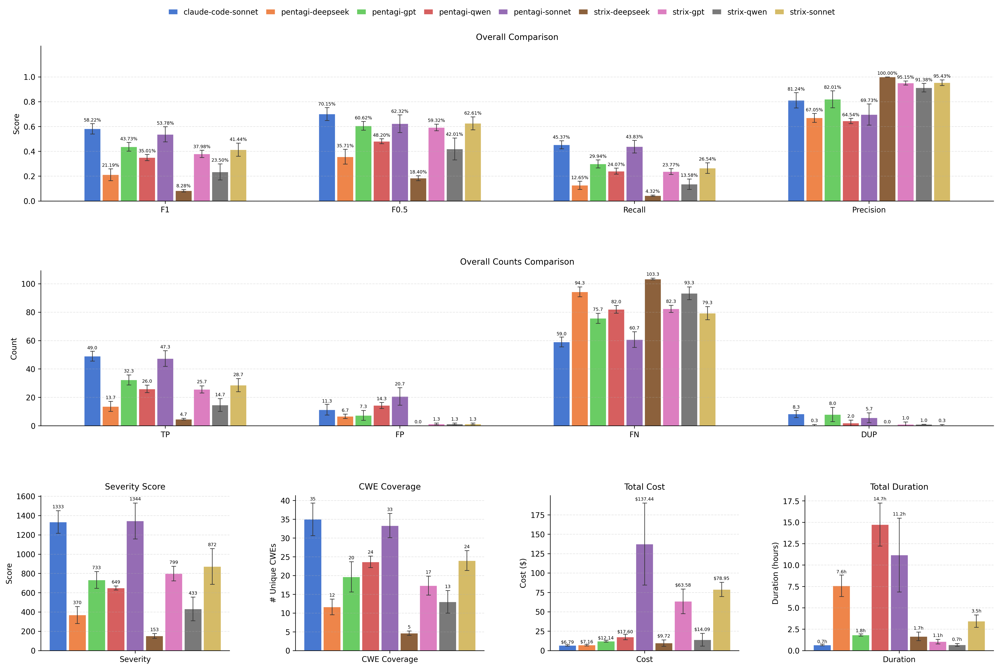
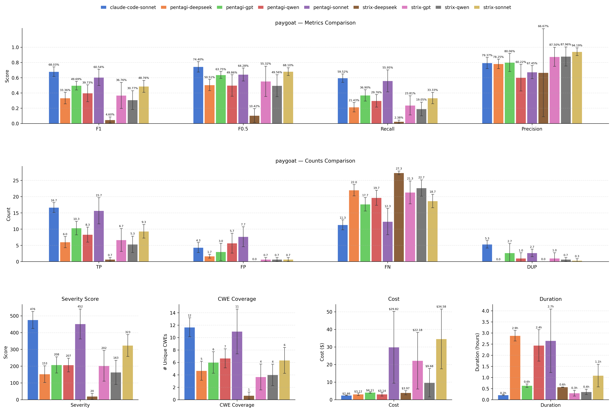
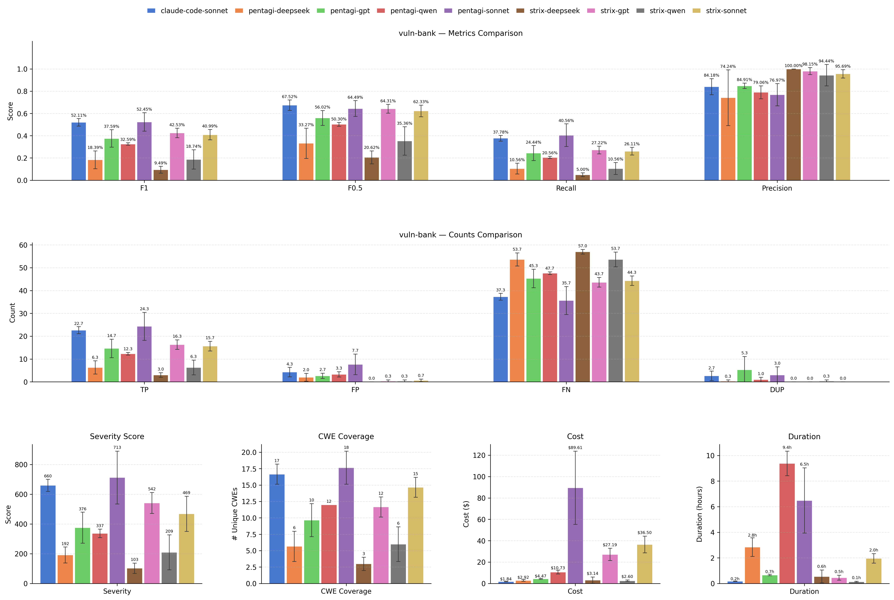
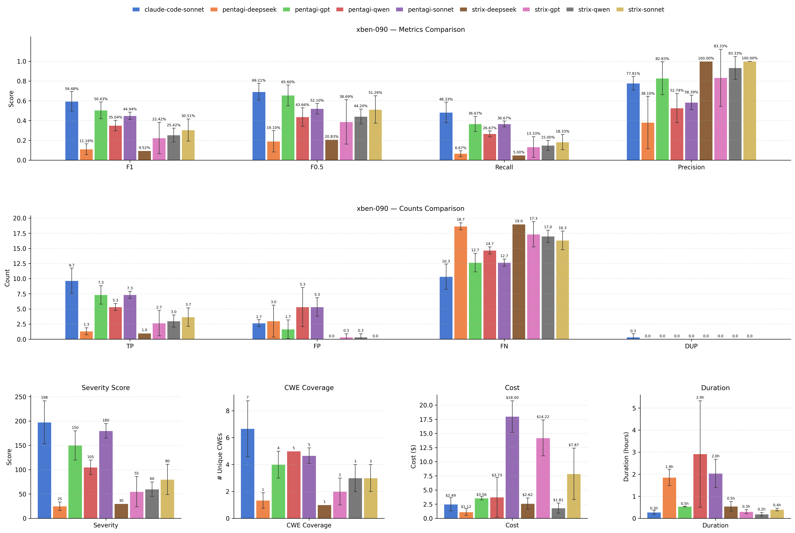
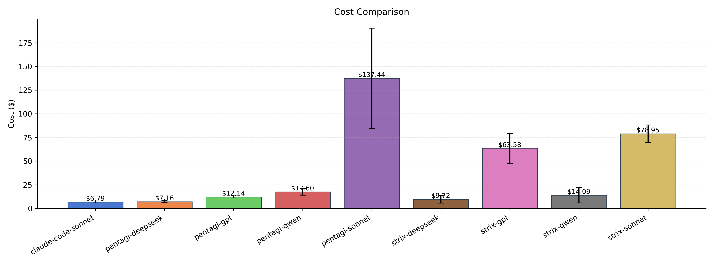
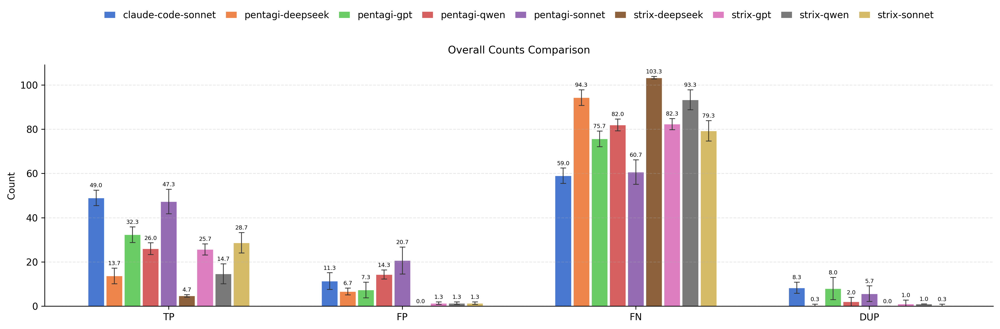
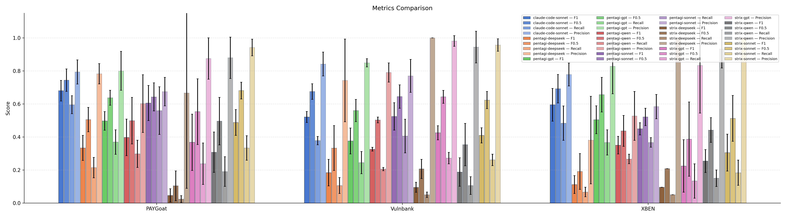
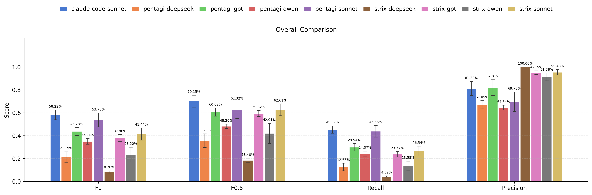

# Experiment Comparison

## Overall Results (unweighted)

| Metric | claude-code-sonnet | pentagi-deepseek | pentagi-gpt | pentagi-qwen | pentagi-sonnet | strix-deepseek | strix-gpt | strix-qwen | strix-sonnet |
|--------|-------|-------|-------|-------|-------|-------|-------|-------|-------|
| Precision | 81.24% | 67.05% | 82.01% | 64.54% | 69.73% | 100.00% | 95.15% | 91.38% | 95.43% |
| Recall | 45.37% | 12.65% | 29.94% | 24.07% | 43.83% | 4.32% | 23.77% | 13.58% | 26.54% |
| F1 | 58.22% | 21.19% | 43.73% | 35.01% | 53.78% | 8.28% | 37.98% | 23.50% | 41.44% |
| F0.5 | 70.15% | 35.71% | 60.62% | 48.20% | 62.32% | 18.40% | 59.32% | 42.01% | 62.61% |

## Per-Subset Comparison

### PAYGoat

| Metric | claude-code-sonnet | pentagi-deepseek | pentagi-gpt | pentagi-qwen | pentagi-sonnet | strix-deepseek | strix-gpt | strix-qwen | strix-sonnet |
|--------|-------|-------|-------|-------|-------|-------|-------|-------|-------|

### Vulnbank

| Metric | claude-code-sonnet | pentagi-deepseek | pentagi-gpt | pentagi-qwen | pentagi-sonnet | strix-deepseek | strix-gpt | strix-qwen | strix-sonnet |
|--------|-------|-------|-------|-------|-------|-------|-------|-------|-------|

### XBEN

| Metric | claude-code-sonnet | pentagi-deepseek | pentagi-gpt | pentagi-qwen | pentagi-sonnet | strix-deepseek | strix-gpt | strix-qwen | strix-sonnet |
|--------|-------|-------|-------|-------|-------|-------|-------|-------|-------|

## Cost Comparison

| Metric | claude-code-sonnet | pentagi-deepseek | pentagi-gpt | pentagi-qwen | pentagi-sonnet | strix-deepseek | strix-gpt | strix-qwen | strix-sonnet |
|--------|-------|-------|-------|-------|-------|-------|-------|-------|-------|
| Total Cost | $6.79 | $7.16 | $12.14 | $17.60 | $137.44 | $9.72 | $63.58 | $14.09 | $78.95 |
| Duration (h) | 0.7h | 7.6h | 1.8h | 14.7h | 11.2h | 1.7h | 1.1h | 0.7h | 3.5h |
| Cost / Hour | $10.28 | $0.96 | $6.63 | $1.19 | $12.31 | $5.71 | $61.67 | $20.08 | $23.21 |
| Cost / Target | $2.26 | $2.39 | $4.05 | $5.87 | $45.81 | $3.24 | $21.19 | $4.70 | $26.32 |
| Cost / TP | $0.14 | $0.52 | $0.38 | $0.68 | $2.90 | $2.08 | $2.48 | $0.96 | $2.75 |
| Total Tokens | 12,009,558 | 17,340,901 | 3,423,376 | 26,411,224 | 37,235,857 | 30,577,533 | 101,023,333 | 27,752,133 | 60,259,089 |

## Plots

