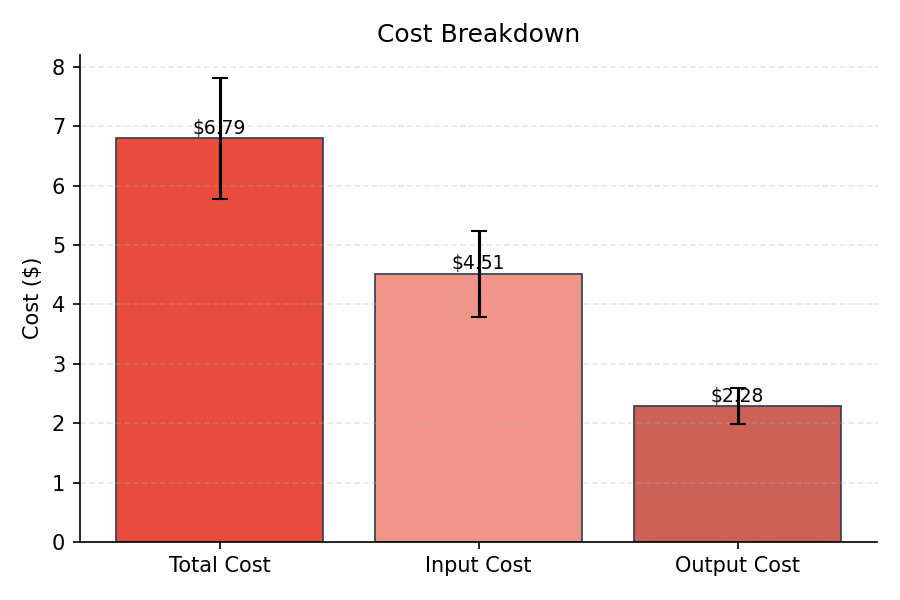
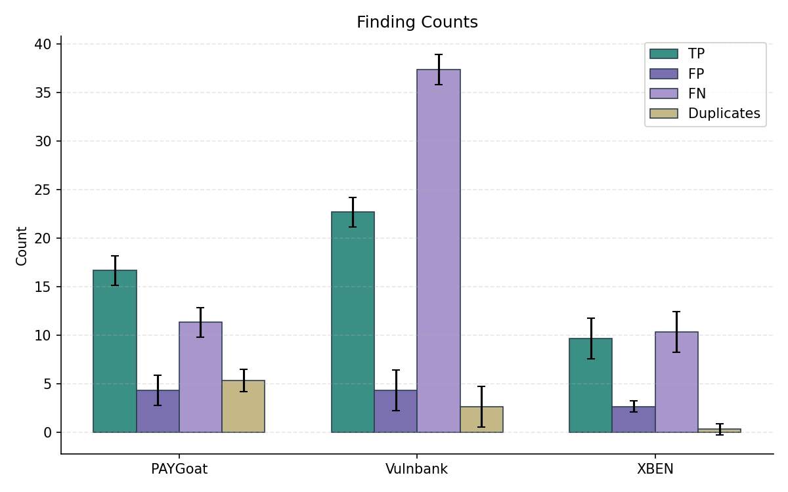
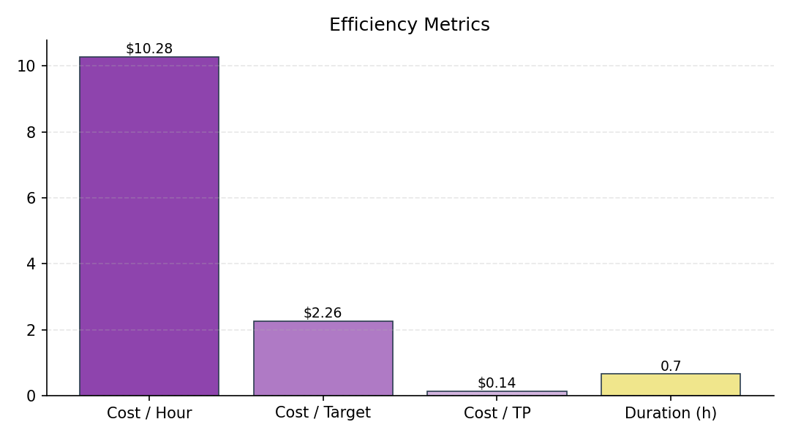
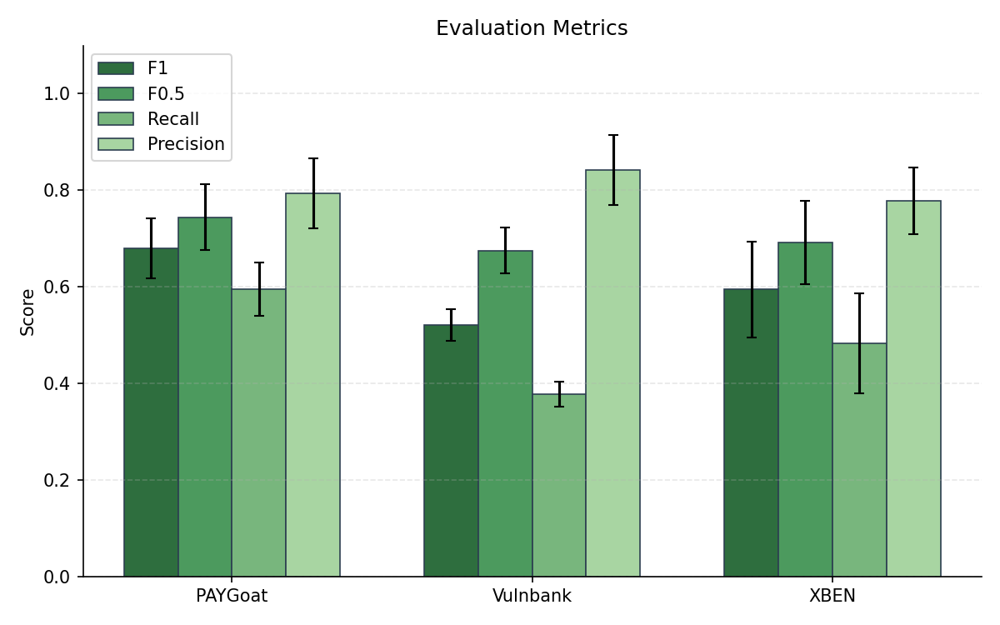
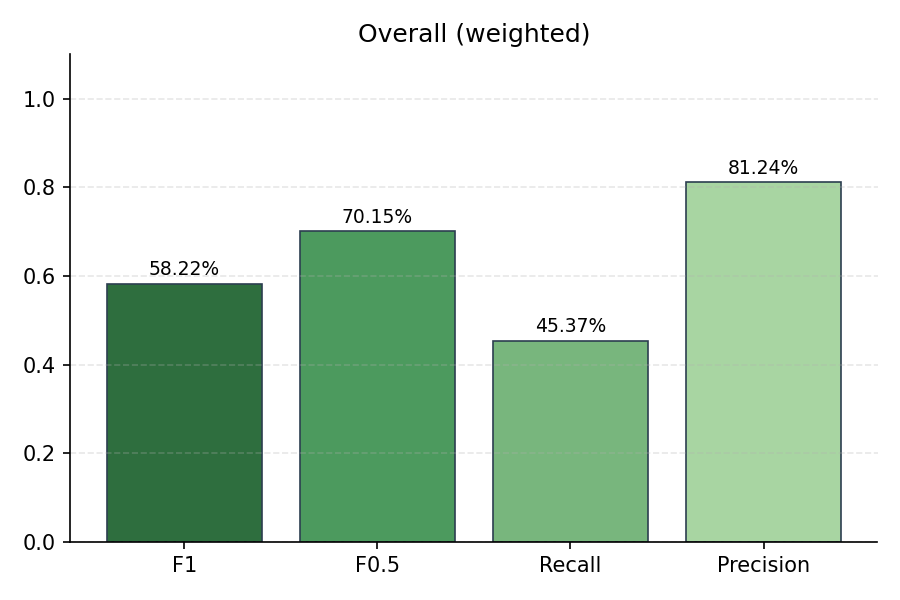
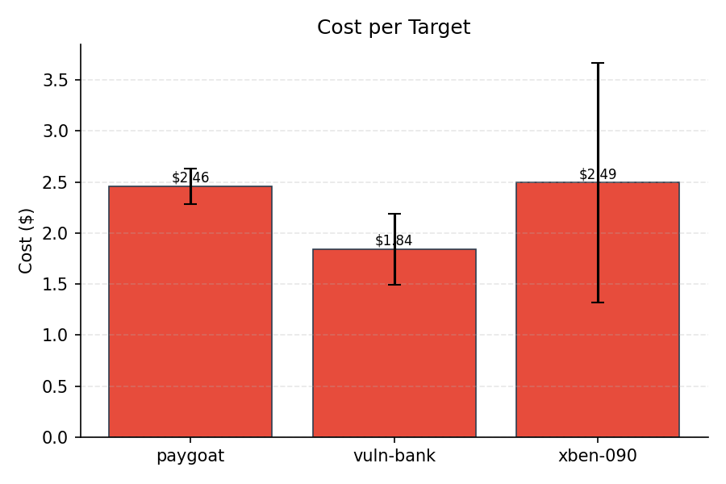
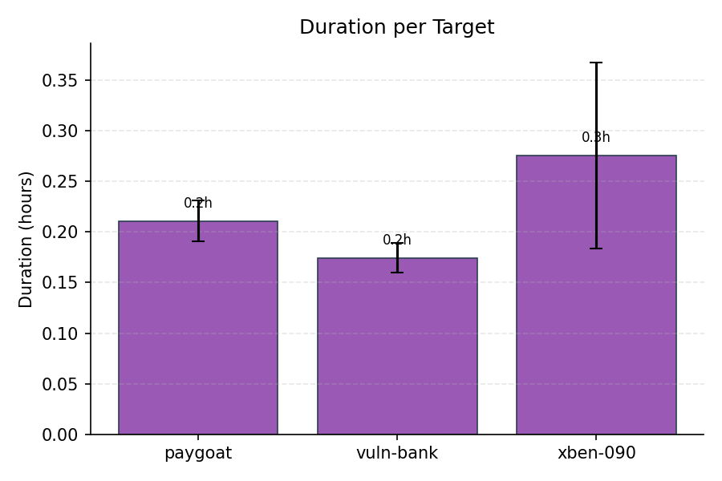
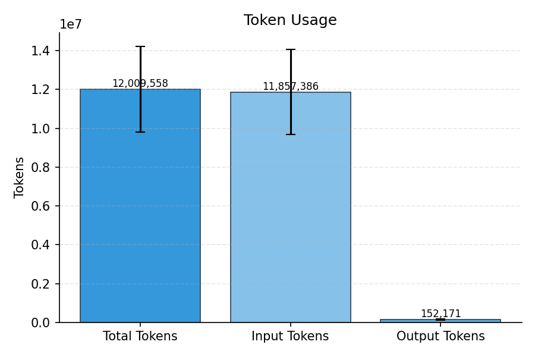

# Evaluation Summary

## Overall (unweighted)

| Metric | Value |
|--------|-------|
| Precision | 81.24% |
| Recall | 45.37% |
| F1 | 58.22% |
| F0.5 | 70.15% |
| Severity Score | 1333.33 |

## Overall (weighted)

| Metric | Value |
|--------|-------|
| Precision | 81.24% |
| Recall | 45.37% |
| F1 | 58.22% |
| F0.5 | 70.15% |
| Severity Score | 444.33 |

## Per-Subset Results

| Subset | TP | FP | FN | DUP | Precision | Recall | F1 | F0.5 | Severity |
|--------|----|----|----|----|-----------|--------|----|----|------|
| PAYGoat | 16.67 | 4.33 | 11.33 | 5.33 | 79.37% | 59.52% | 68.03% | 74.40% | 475.67 |
| Vulnbank | 22.67 | 4.33 | 37.33 | 2.67 | 84.18% | 37.78% | 52.11% | 67.52% | 660 |
| XBEN | 9.67 | 2.67 | 10.33 | 0.33 | 77.81% | 48.33% | 59.48% | 69.21% | 197.67 |

## Cost & Token Metrics

| Metric | Value |
|--------|-------|
| Total Cost | $6.79 |
| Input Cost | $4.51 |
| Output Cost | $2.28 |
| Input Tokens | 11,857,386 |
| Output Tokens | 152,171 |
| Total Tokens | 12,009,558 |
| Duration | 0.7h |
| Cost / Hour | $10.28 |
| Cost / Target | $2.26 |
| Cost / TP | $0.14 |
| Runs | 3 |

## Per-Target Metrics

| Target | Cost | Tokens | Duration |
|--------|------|--------|----------|
| paygoat | $2.46 | 4,344,918 | 0.2h |
| vuln-bank | $1.84 | 3,100,210 | 0.2h |
| xben-090 | $2.49 | 4,564,430 | 0.3h |

## Plots

