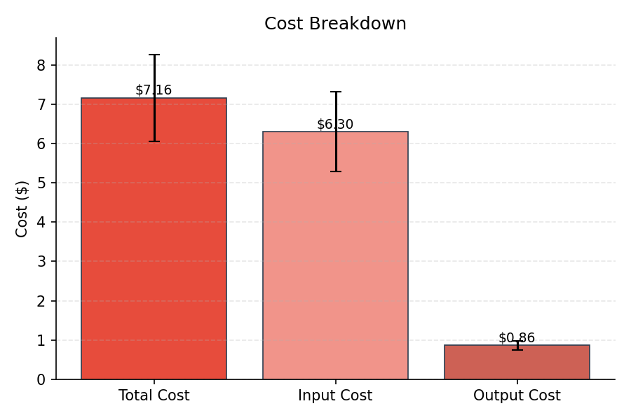
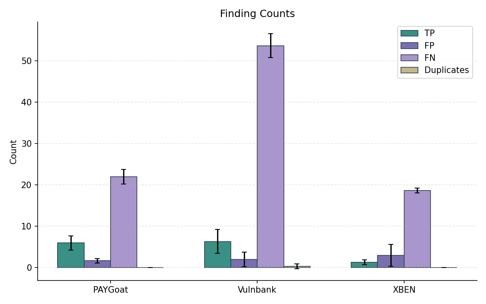
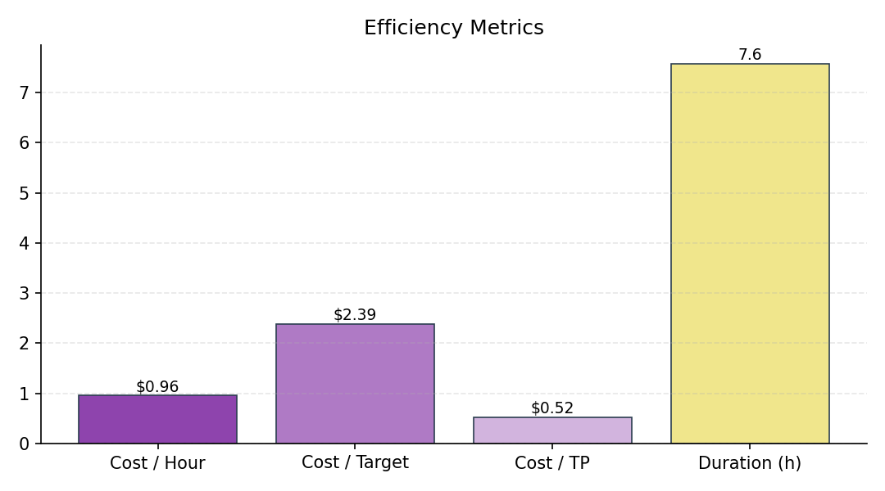
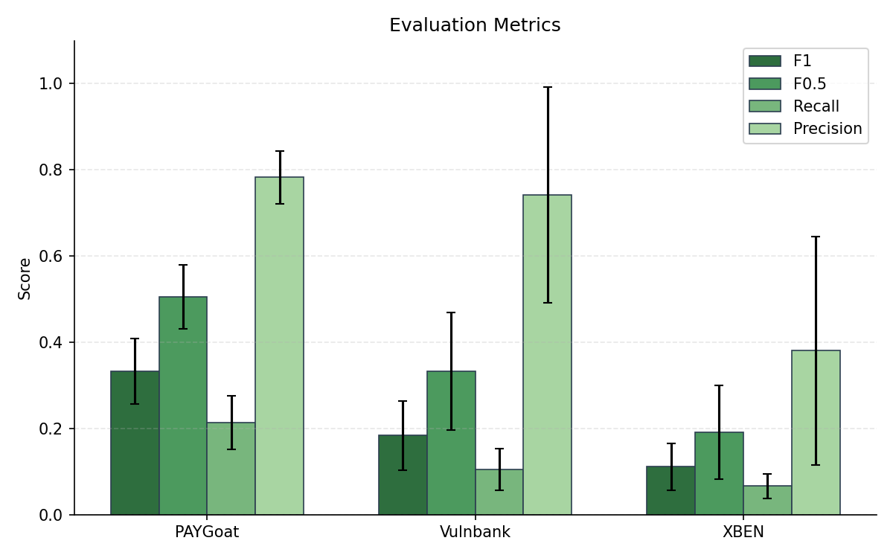
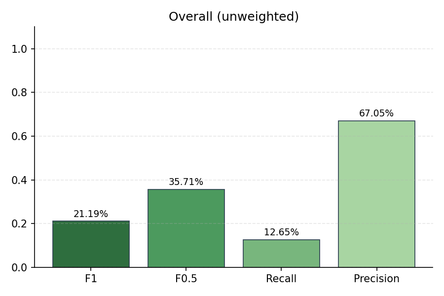
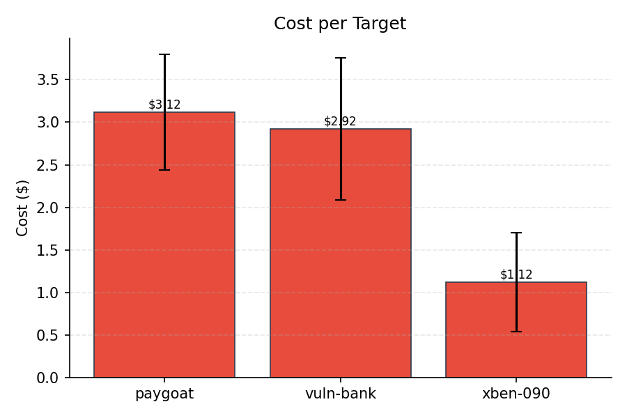
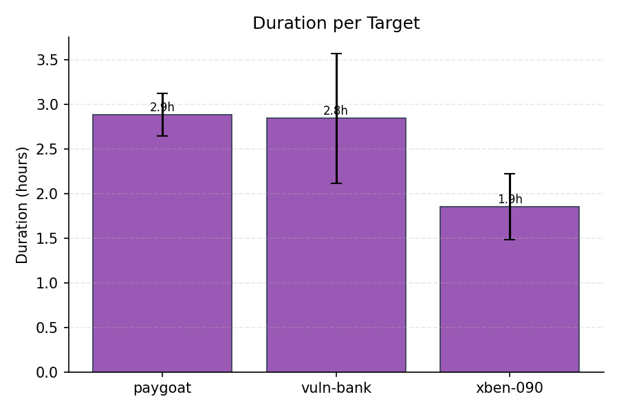
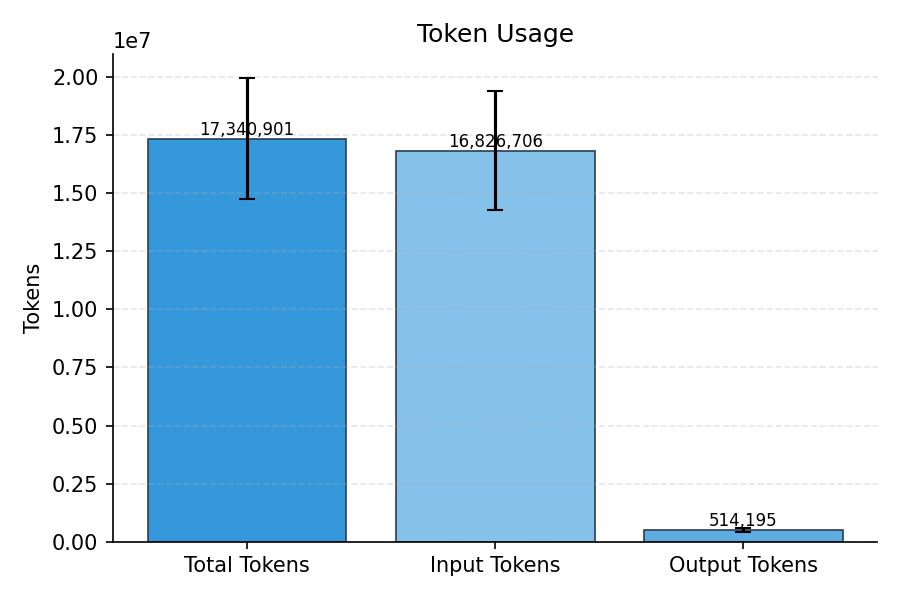

# Evaluation Summary

## Overall (unweighted)

| Metric | Value |
|--------|-------|
| Precision | 67.05% |
| Recall | 12.65% |
| F1 | 21.19% |
| F0.5 | 35.71% |
| Severity Score | 369.67 |

## Overall (weighted)

| Metric | Value |
|--------|-------|
| Precision | 67.05% |
| Recall | 12.65% |
| F1 | 21.19% |
| F0.5 | 35.71% |
| Severity Score | 123 |

## Per-Subset Results

| Subset | TP | FP | FN | DUP | Precision | Recall | F1 | F0.5 | Severity |
|--------|----|----|----|----|-----------|--------|----|----|------|
| PAYGoat | 6 | 1.67 | 22 | 0 | 78.25% | 21.43% | 33.36% | 50.51% | 152.67 |
| Vulnbank | 6.33 | 2 | 53.67 | 0.33 | 74.24% | 10.56% | 18.39% | 33.27% | 192 |
| XBEN | 1.33 | 3 | 18.67 | 0 | 38.10% | 6.67% | 11.16% | 19.10% | 25 |

## Cost & Token Metrics

| Metric | Value |
|--------|-------|
| Total Cost | $7.16 |
| Input Cost | $6.30 |
| Output Cost | $0.86 |
| Input Tokens | 16,826,706 |
| Output Tokens | 514,195 |
| Total Tokens | 17,340,901 |
| Duration | 7.6h |
| Cost / Hour | $0.96 |
| Cost / Target | $2.39 |
| Cost / TP | $0.52 |
| Runs | 3 |

## Per-Target Metrics

| Target | Cost | Tokens | Duration |
|--------|------|--------|----------|
| paygoat | $3.12 | 7,696,718 | 2.9h |
| vuln-bank | $2.92 | 7,091,410 | 2.8h |
| xben-090 | $1.12 | 2,552,774 | 1.9h |

## Plots

