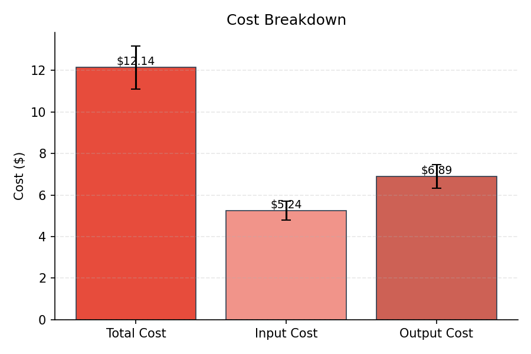
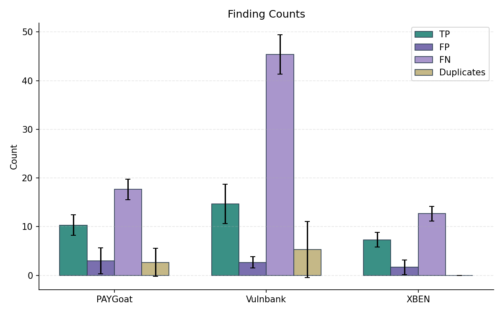
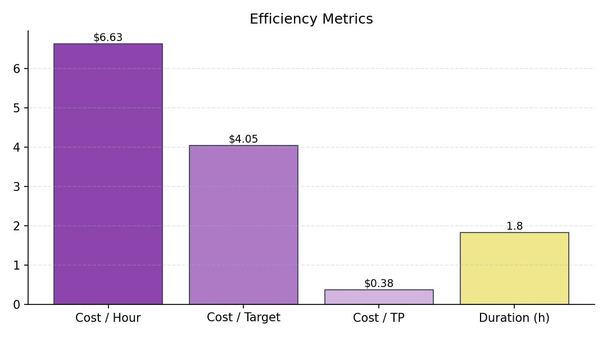
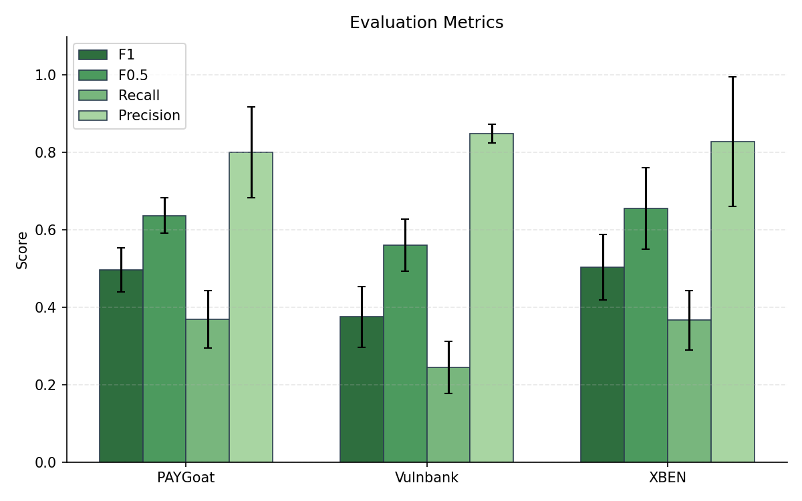
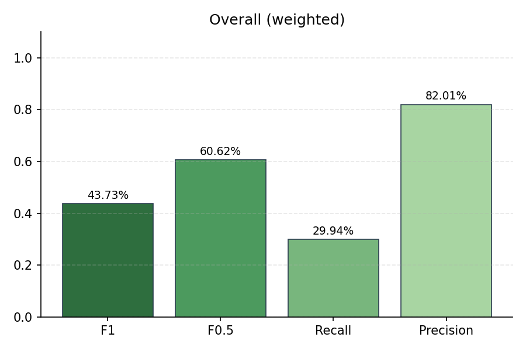
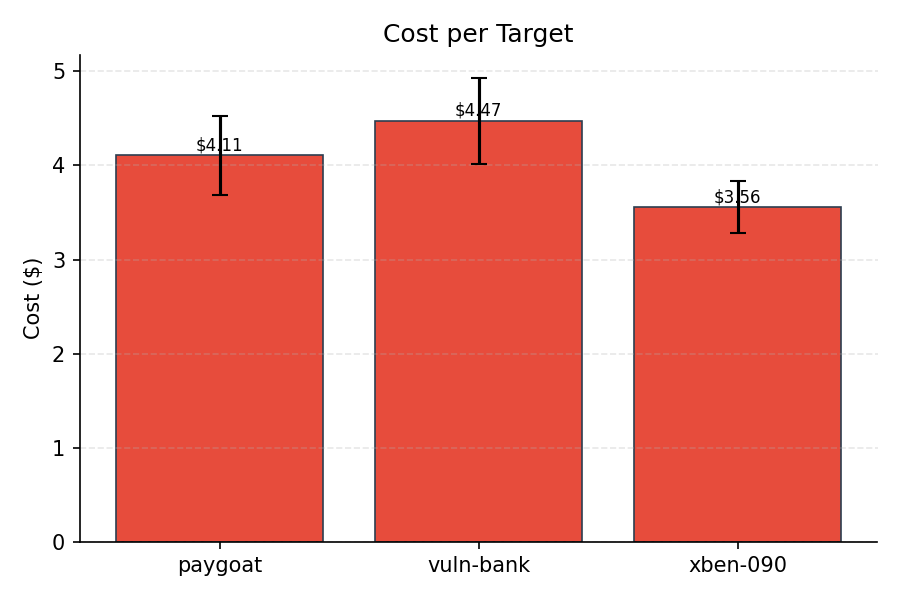
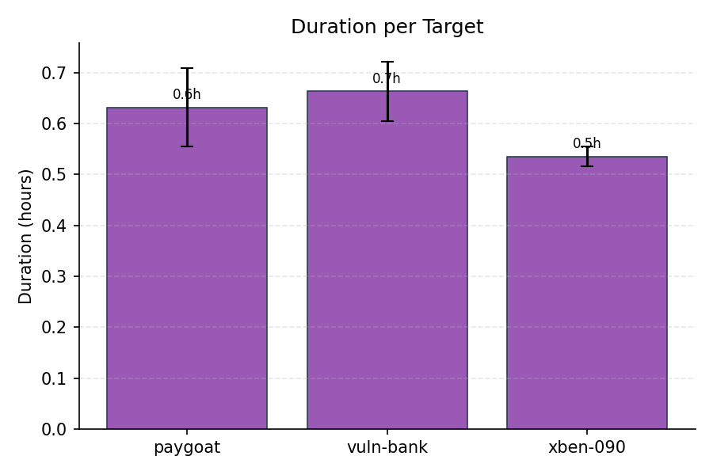
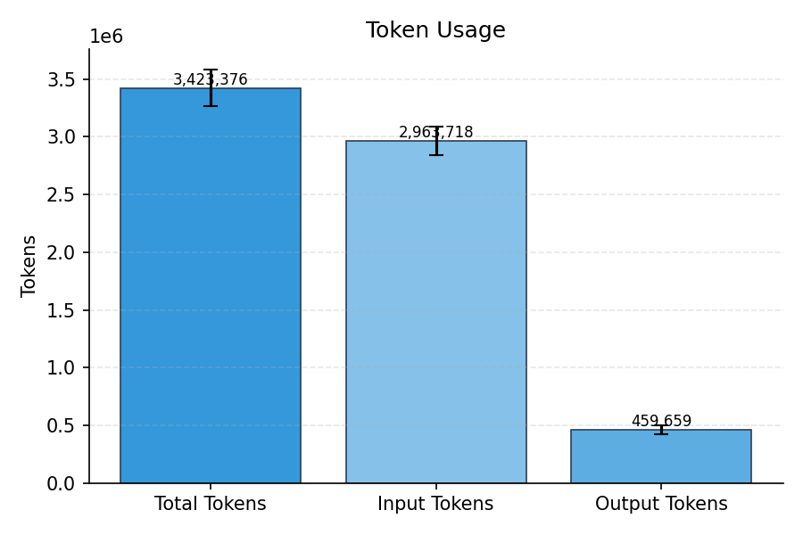

# Evaluation Summary

## Overall (unweighted)

| Metric | Value |
|--------|-------|
| Precision | 82.01% |
| Recall | 29.94% |
| F1 | 43.73% |
| F0.5 | 60.62% |
| Severity Score | 733.33 |

## Overall (weighted)

| Metric | Value |
|--------|-------|
| Precision | 82.01% |
| Recall | 29.94% |
| F1 | 43.73% |
| F0.5 | 60.62% |
| Severity Score | 244.33 |

## Per-Subset Results

| Subset | TP | FP | FN | DUP | Precision | Recall | F1 | F0.5 | Severity |
|--------|----|----|----|----|-----------|--------|----|----|------|
| PAYGoat | 10.33 | 3 | 17.67 | 2.67 | 80.06% | 36.90% | 49.69% | 63.75% | 207.67 |
| Vulnbank | 14.67 | 2.67 | 45.33 | 5.33 | 84.91% | 24.44% | 37.59% | 56.02% | 375.67 |
| XBEN | 7.33 | 1.67 | 12.67 | 0 | 82.83% | 36.67% | 50.43% | 65.60% | 150 |

## Cost & Token Metrics

| Metric | Value |
|--------|-------|
| Total Cost | $12.14 |
| Input Cost | $5.24 |
| Output Cost | $6.89 |
| Input Tokens | 2,963,718 |
| Output Tokens | 459,659 |
| Total Tokens | 3,423,376 |
| Duration | 1.8h |
| Cost / Hour | $6.63 |
| Cost / Target | $4.05 |
| Cost / TP | $0.38 |
| Runs | 3 |

## Per-Target Metrics

| Target | Cost | Tokens | Duration |
|--------|------|--------|----------|
| paygoat | $4.11 | 1,166,931 | 0.6h |
| vuln-bank | $4.47 | 1,256,567 | 0.7h |
| xben-090 | $3.56 | 999,878 | 0.5h |

## Plots

