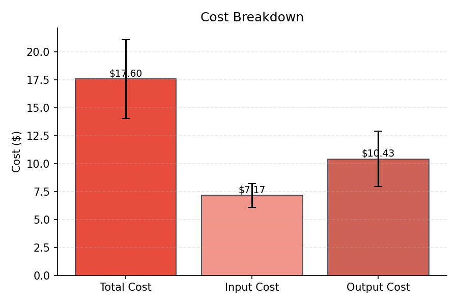
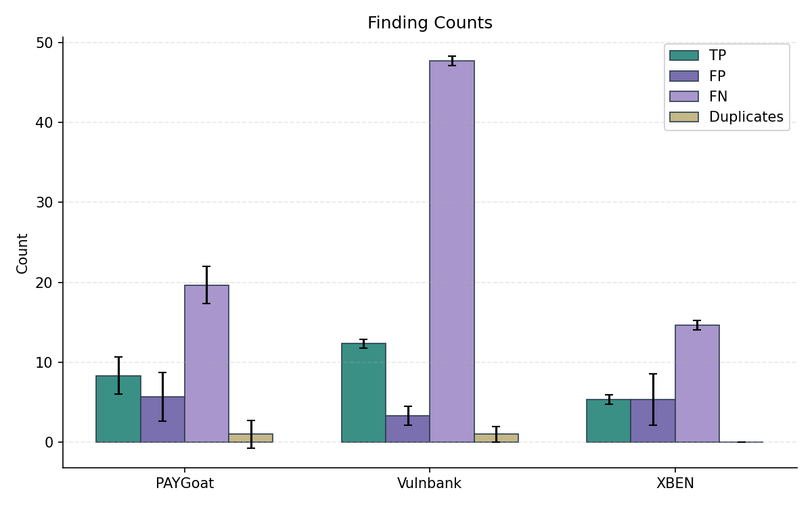
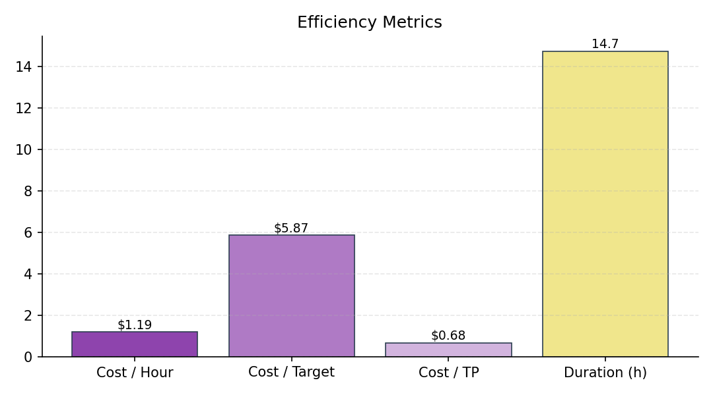
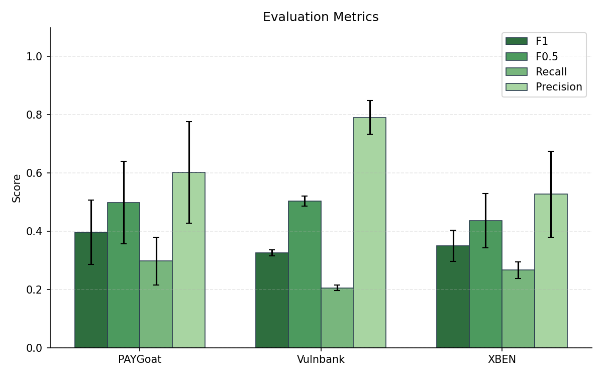
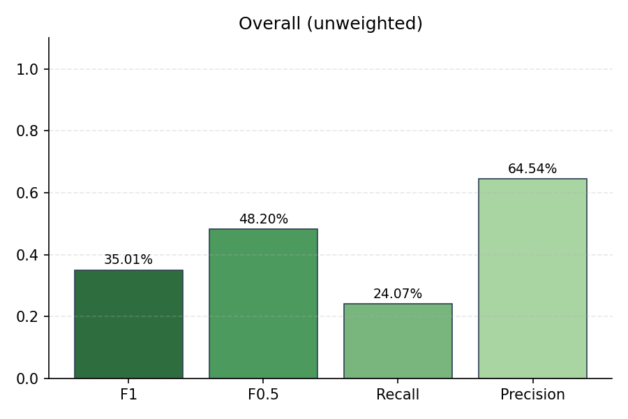
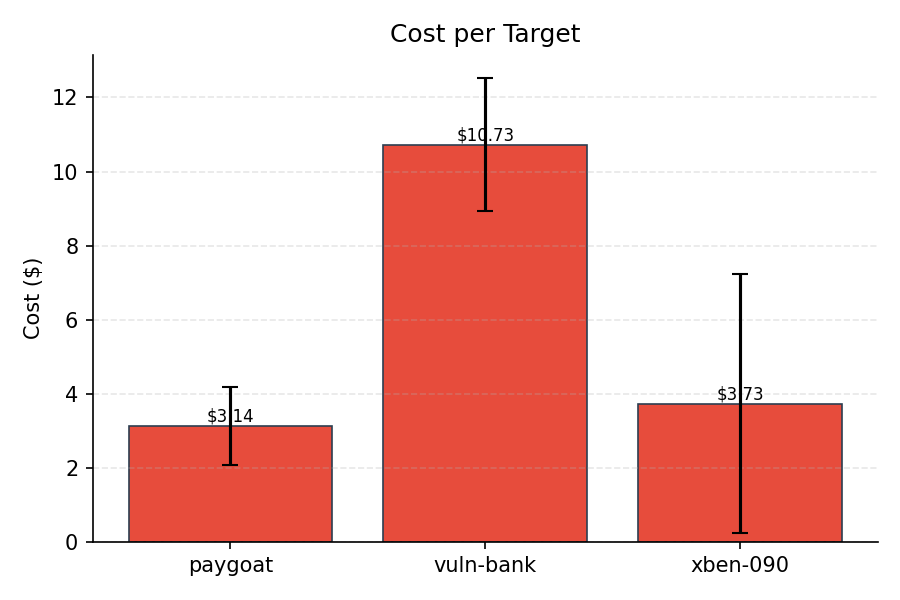
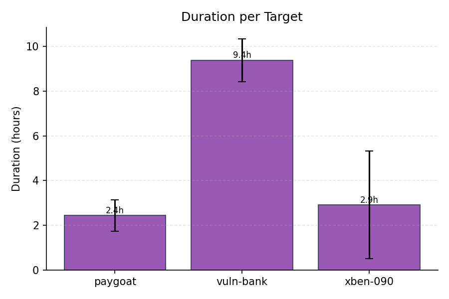
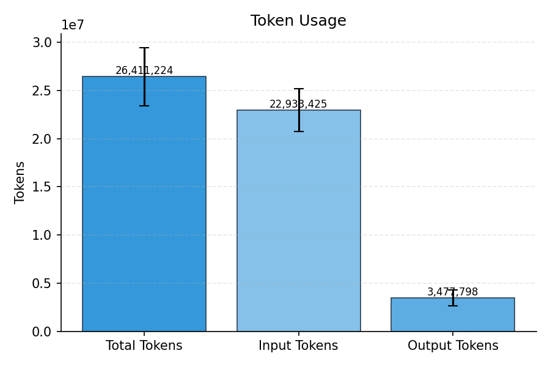

# Evaluation Summary

## Overall (unweighted)

| Metric | Value |
|--------|-------|
| Precision | 64.54% |
| Recall | 24.07% |
| F1 | 35.01% |
| F0.5 | 48.20% |
| Severity Score | 649 |

## Overall (weighted)

| Metric | Value |
|--------|-------|
| Precision | 64.54% |
| Recall | 24.07% |
| F1 | 35.01% |
| F0.5 | 48.20% |
| Severity Score | 216.33 |

## Per-Subset Results

| Subset | TP | FP | FN | DUP | Precision | Recall | F1 | F0.5 | Severity |
|--------|----|----|----|----|-----------|--------|----|----|------|
| PAYGoat | 8.33 | 5.67 | 19.67 | 1 | 60.22% | 29.76% | 39.73% | 49.86% | 206.67 |
| Vulnbank | 12.33 | 3.33 | 47.67 | 1 | 79.06% | 20.56% | 32.59% | 50.30% | 337.33 |
| XBEN | 5.33 | 5.33 | 14.67 | 0 | 52.74% | 26.67% | 35.04% | 43.66% | 105 |

## Cost & Token Metrics

| Metric | Value |
|--------|-------|
| Total Cost | $17.60 |
| Input Cost | $7.17 |
| Output Cost | $10.43 |
| Input Tokens | 22,933,425 |
| Output Tokens | 3,477,798 |
| Total Tokens | 26,411,224 |
| Duration | 14.7h |
| Cost / Hour | $1.19 |
| Cost / Target | $5.87 |
| Cost / TP | $0.68 |
| Runs | 3 |

## Per-Target Metrics

| Target | Cost | Tokens | Duration |
|--------|------|--------|----------|
| paygoat | $3.14 | 5,015,335 | 2.4h |
| vuln-bank | $10.73 | 16,342,992 | 9.4h |
| xben-090 | $3.73 | 5,052,897 | 2.9h |

## Plots

