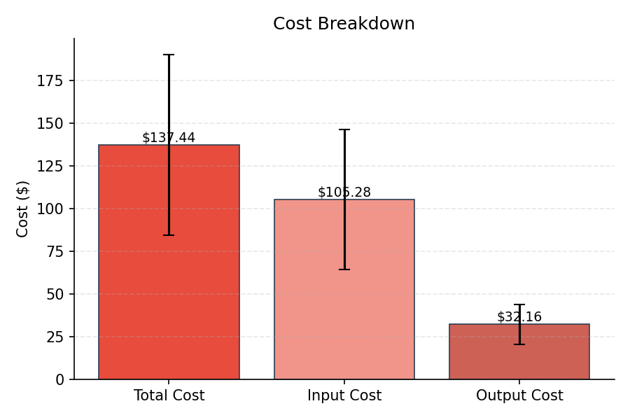
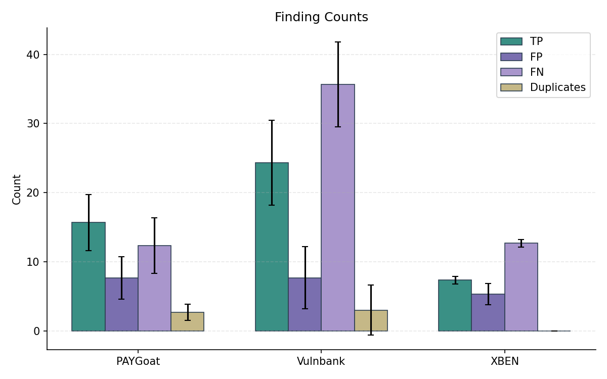
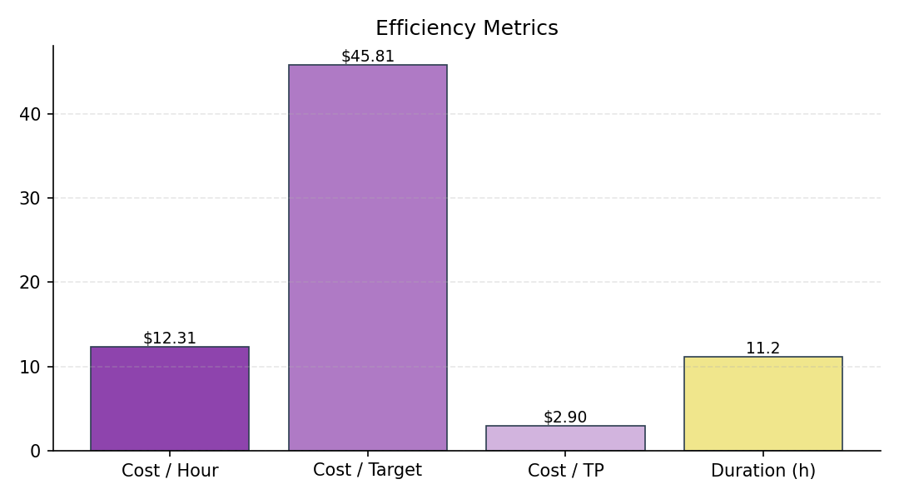
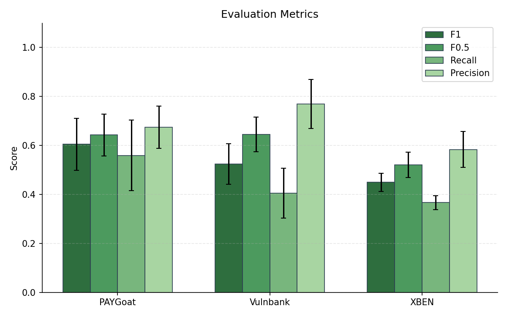
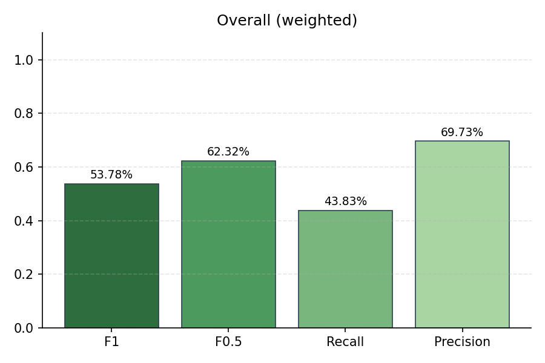
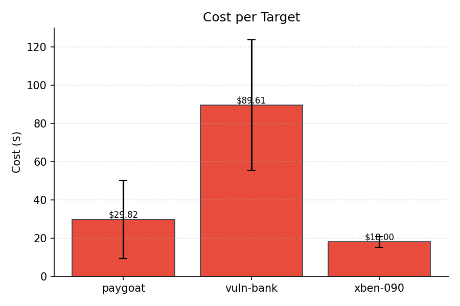
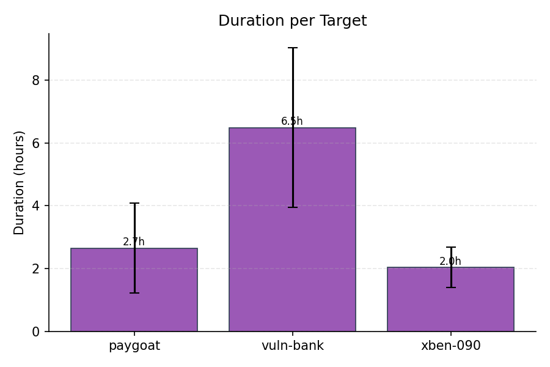
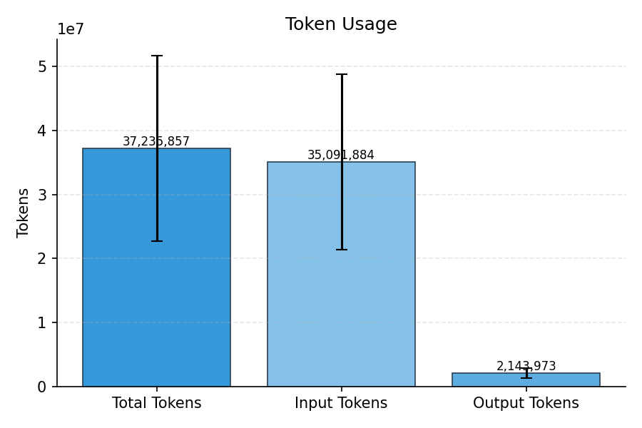

# Evaluation Summary

## Overall (unweighted)

| Metric | Value |
|--------|-------|
| Precision | 69.73% |
| Recall | 43.83% |
| F1 | 53.78% |
| F0.5 | 62.32% |
| Severity Score | 1344.33 |

## Overall (weighted)

| Metric | Value |
|--------|-------|
| Precision | 69.73% |
| Recall | 43.83% |
| F1 | 53.78% |
| F0.5 | 62.32% |
| Severity Score | 448 |

## Per-Subset Results

| Subset | TP | FP | FN | DUP | Precision | Recall | F1 | F0.5 | Severity |
|--------|----|----|----|----|-----------|--------|----|----|------|
| PAYGoat | 15.67 | 7.67 | 12.33 | 2.67 | 67.45% | 55.95% | 60.54% | 64.28% | 451.67 |
| Vulnbank | 24.33 | 7.67 | 35.67 | 3 | 76.97% | 40.56% | 52.45% | 64.49% | 712.67 |
| XBEN | 7.33 | 5.33 | 12.67 | 0 | 58.39% | 36.67% | 44.94% | 52.10% | 180 |

## Cost & Token Metrics

| Metric | Value |
|--------|-------|
| Total Cost | $137.44 |
| Input Cost | $105.28 |
| Output Cost | $32.16 |
| Input Tokens | 35,091,884 |
| Output Tokens | 2,143,973 |
| Total Tokens | 37,235,857 |
| Duration | 11.2h |
| Cost / Hour | $12.31 |
| Cost / Target | $45.81 |
| Cost / TP | $2.90 |
| Runs | 3 |

## Per-Target Metrics

| Target | Cost | Tokens | Duration |
|--------|------|--------|----------|
| paygoat | $29.82 | 7,786,668 | 2.7h |
| vuln-bank | $89.61 | 24,568,267 | 6.5h |
| xben-090 | $18.00 | 4,880,922 | 2.0h |

## Plots

