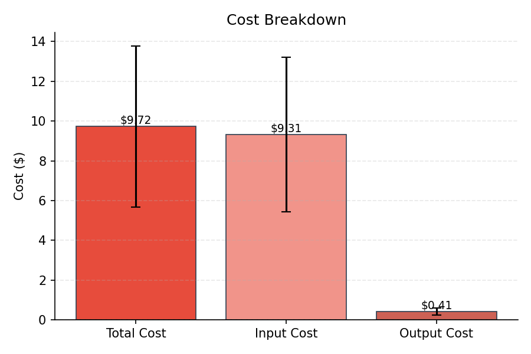
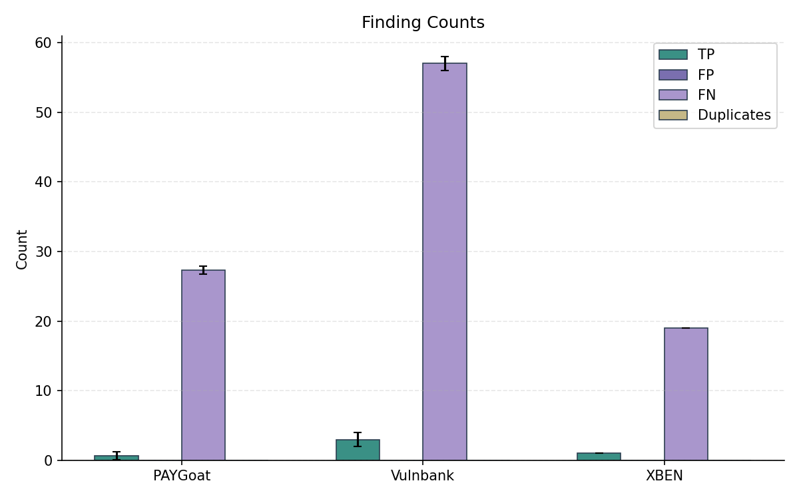
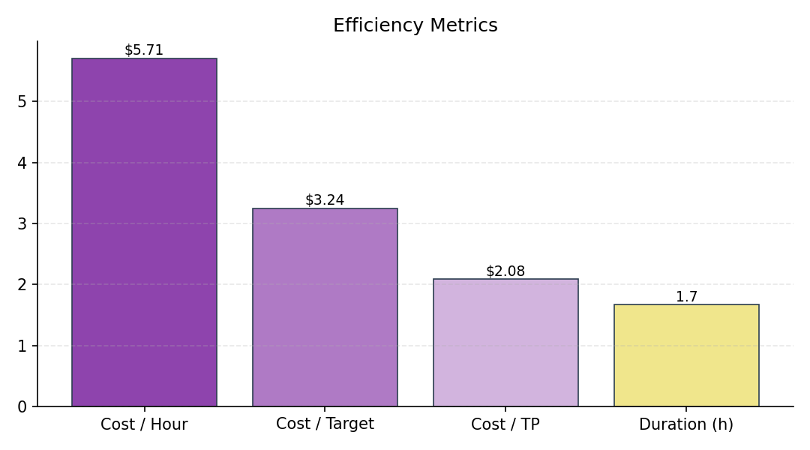
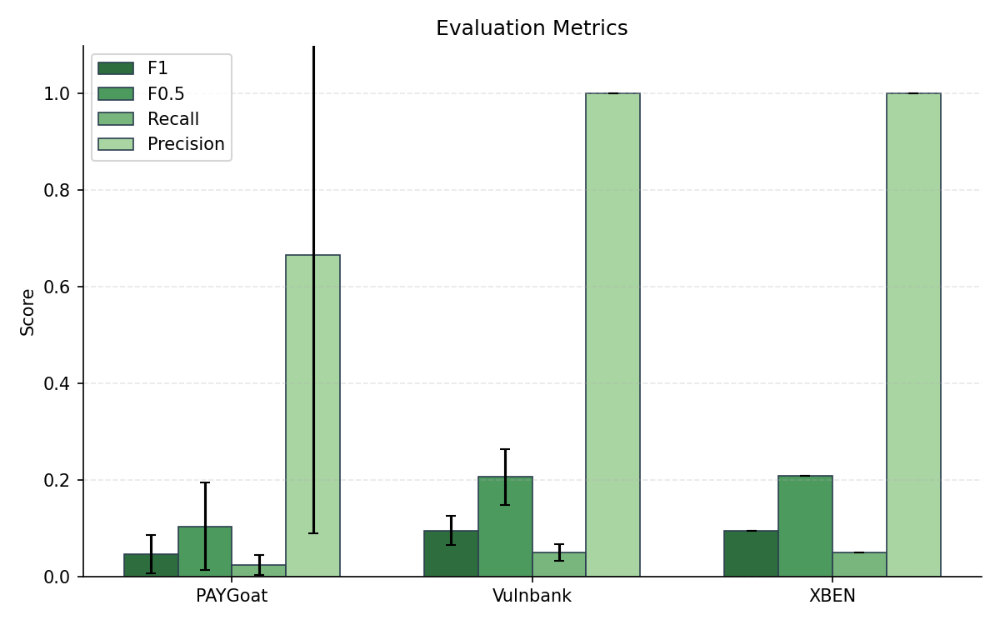
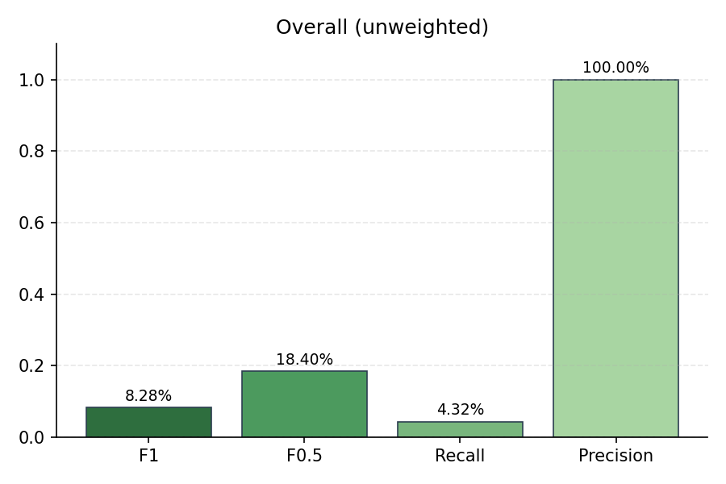
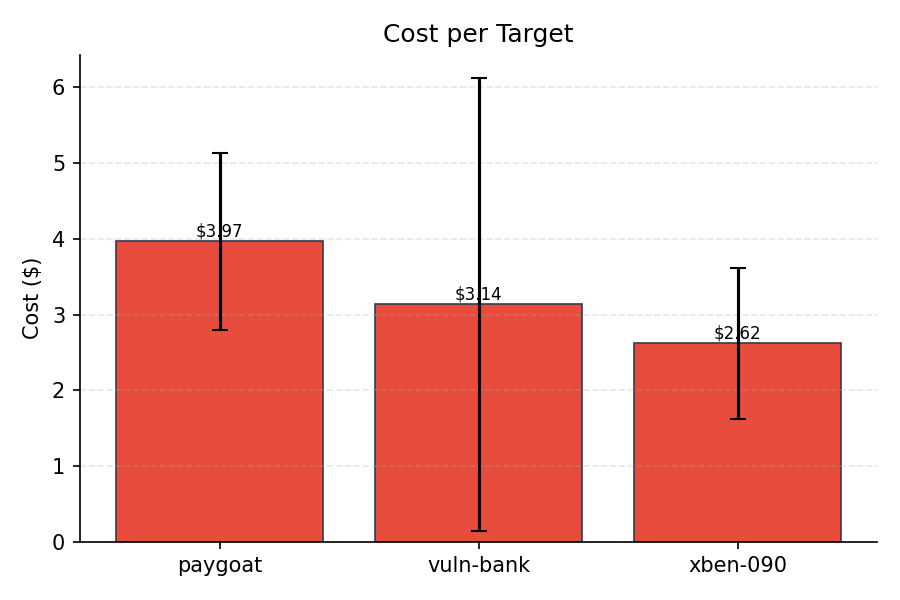
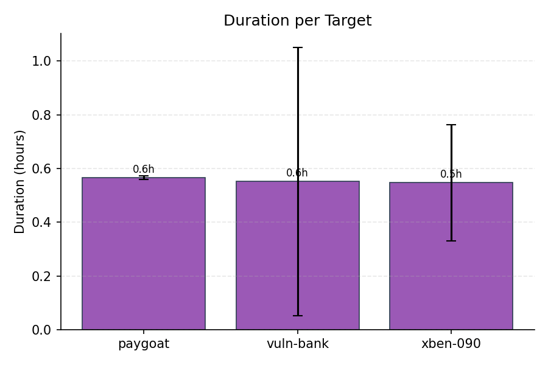
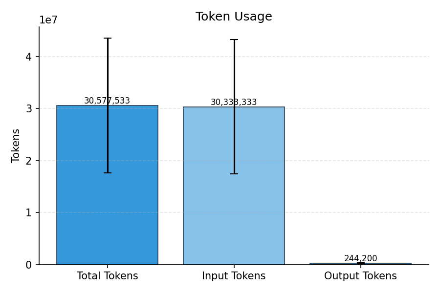

# Evaluation Summary

## Overall (unweighted)

| Metric | Value |
|--------|-------|
| Precision | 100.00% |
| Recall | 4.32% |
| F1 | 8.28% |
| F0.5 | 18.40% |
| Severity Score | 152.67 |

## Overall (weighted)

| Metric | Value |
|--------|-------|
| Precision | 100.00% |
| Recall | 4.32% |
| F1 | 8.28% |
| F0.5 | 18.40% |
| Severity Score | 51 |

## Per-Subset Results

| Subset | TP | FP | FN | DUP | Precision | Recall | F1 | F0.5 | Severity |
|--------|----|----|----|----|-----------|--------|----|----|------|
| PAYGoat | 0.67 | 0 | 27.33 | 0 | 66.67% | 2.38% | 4.60% | 10.42% | 20 |
| Vulnbank | 3 | 0 | 57 | 0 | 100.00% | 5.00% | 9.49% | 20.62% | 102.67 |
| XBEN | 1 | 0 | 19 | 0 | 100.00% | 5.00% | 9.52% | 20.83% | 30 |

## Cost & Token Metrics

| Metric | Value |
|--------|-------|
| Total Cost | $9.72 |
| Input Cost | $9.31 |
| Output Cost | $0.41 |
| Input Tokens | 30,333,333 |
| Output Tokens | 244,200 |
| Total Tokens | 30,577,533 |
| Duration | 1.7h |
| Cost / Hour | $5.71 |
| Cost / Target | $3.24 |
| Cost / TP | $2.08 |
| Runs | 3 |

## Per-Target Metrics

| Target | Cost | Tokens | Duration |
|--------|------|--------|----------|
| paygoat | $3.97 | 12,316,700 | 0.6h |
| vuln-bank | $3.14 | 9,950,867 | 0.6h |
| xben-090 | $2.62 | 8,309,967 | 0.5h |

## Plots

