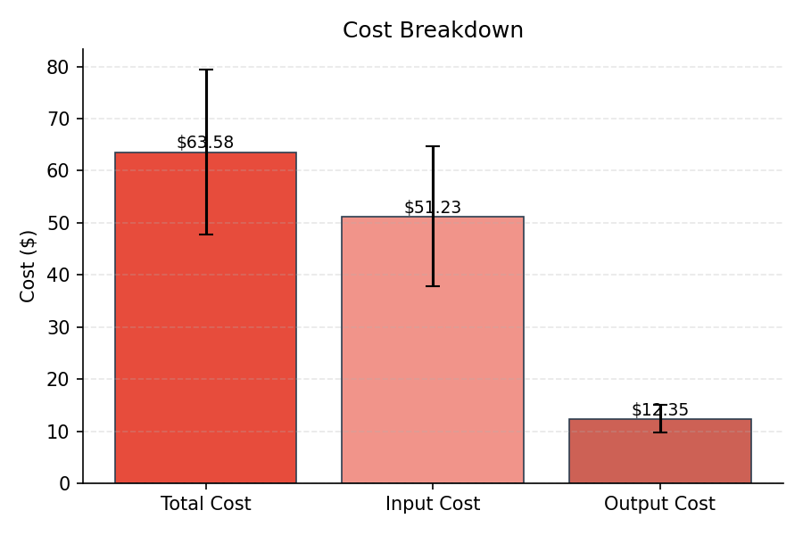
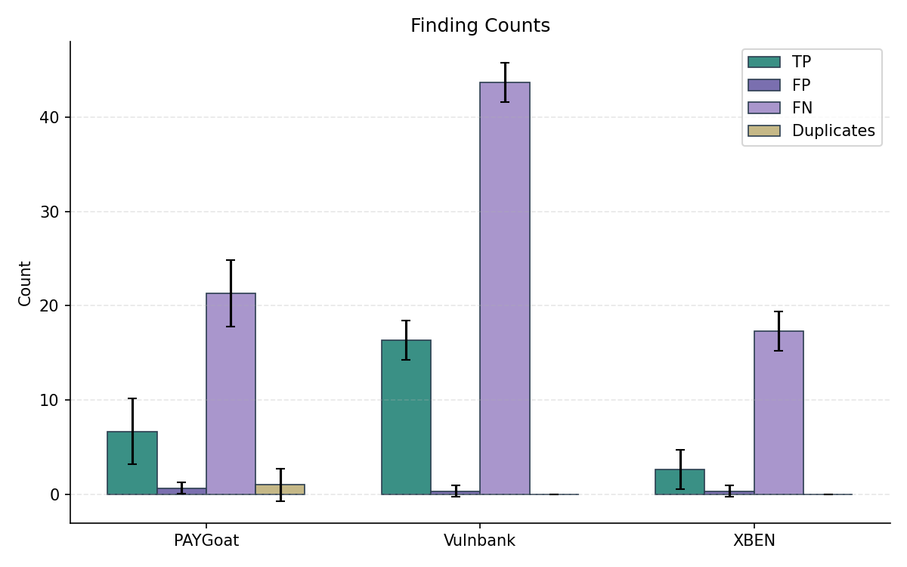
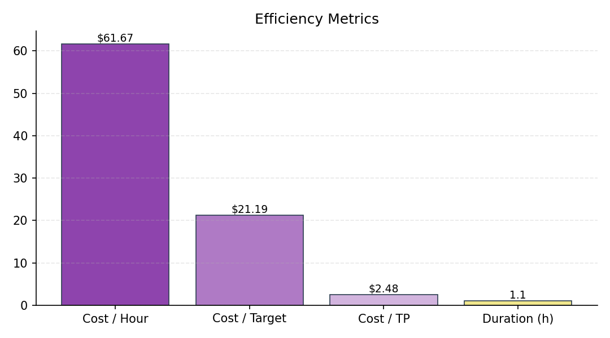
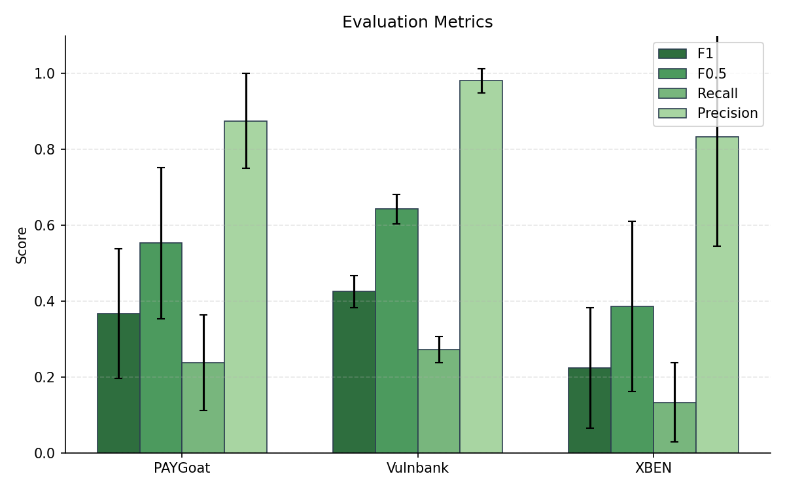
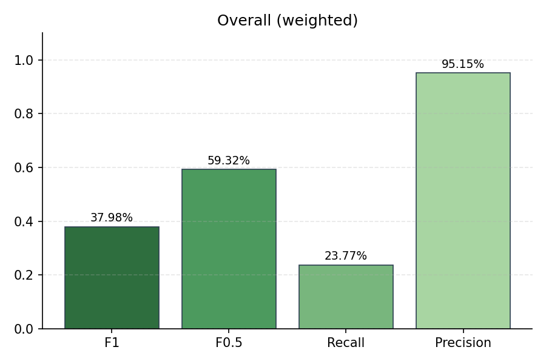
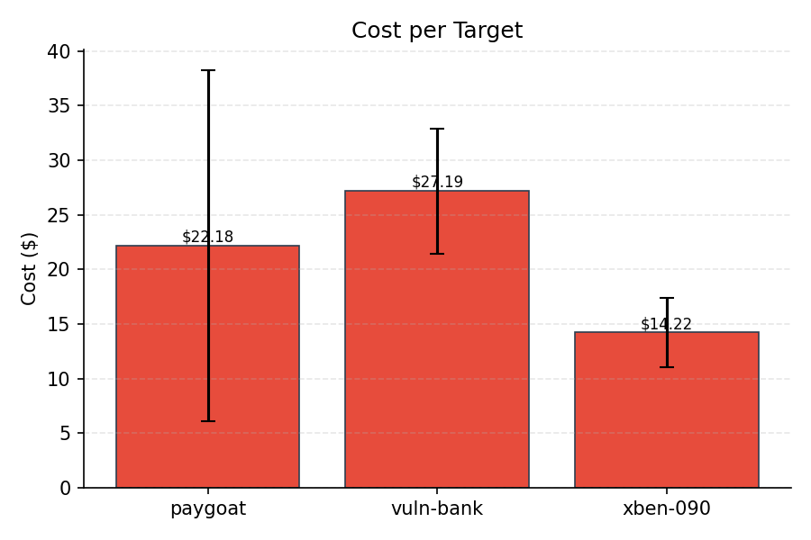
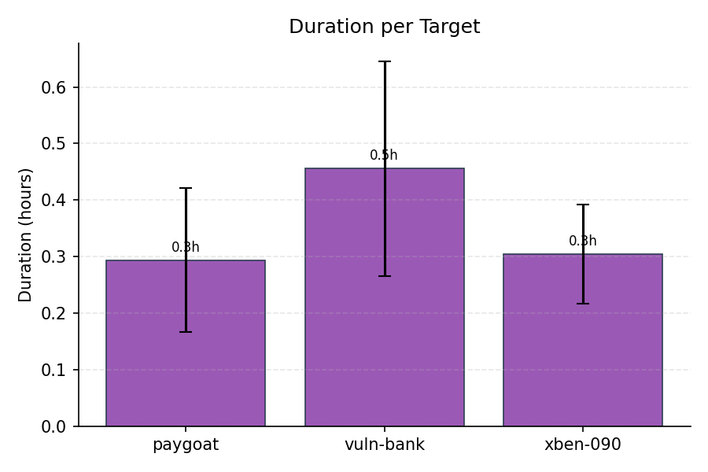
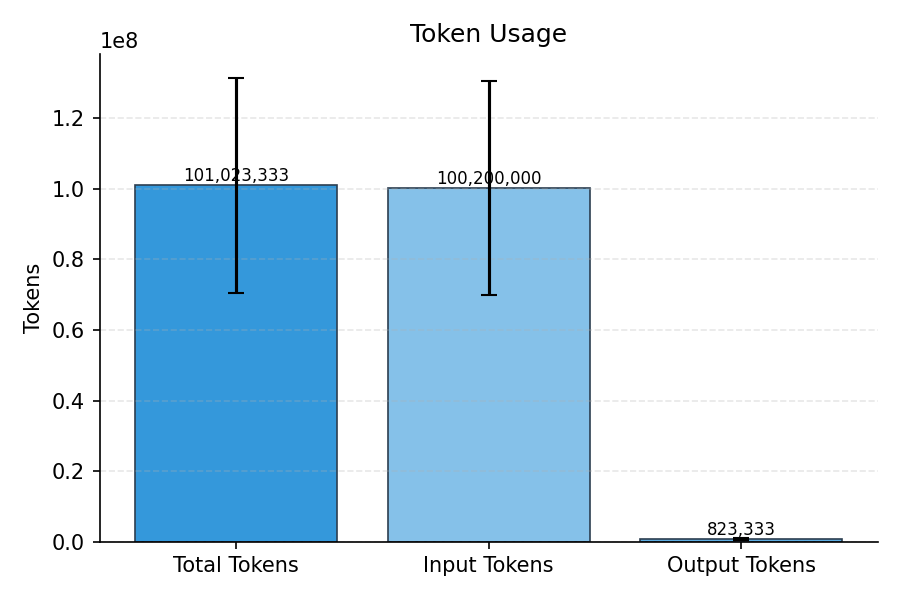

# Evaluation Summary

## Overall (unweighted)

| Metric | Value |
|--------|-------|
| Precision | 95.15% |
| Recall | 23.77% |
| F1 | 37.98% |
| F0.5 | 59.32% |
| Severity Score | 798.67 |

## Overall (weighted)

| Metric | Value |
|--------|-------|
| Precision | 95.15% |
| Recall | 23.77% |
| F1 | 37.98% |
| F0.5 | 59.32% |
| Severity Score | 266 |

## Per-Subset Results

| Subset | TP | FP | FN | DUP | Precision | Recall | F1 | F0.5 | Severity |
|--------|----|----|----|----|-----------|--------|----|----|------|
| PAYGoat | 6.67 | 0.67 | 21.33 | 1 | 87.50% | 23.81% | 36.76% | 55.32% | 202 |
| Vulnbank | 16.33 | 0.33 | 43.67 | 0 | 98.15% | 27.22% | 42.53% | 64.31% | 541.67 |
| XBEN | 2.67 | 0.33 | 17.33 | 0 | 83.33% | 13.33% | 22.42% | 38.69% | 55 |

## Cost & Token Metrics

| Metric | Value |
|--------|-------|
| Total Cost | $63.58 |
| Input Cost | $51.23 |
| Output Cost | $12.35 |
| Input Tokens | 100,200,000 |
| Output Tokens | 823,333 |
| Total Tokens | 101,023,333 |
| Duration | 1.1h |
| Cost / Hour | $61.67 |
| Cost / Target | $21.19 |
| Cost / TP | $2.48 |
| Runs | 3 |

## Per-Target Metrics

| Target | Cost | Tokens | Duration |
|--------|------|--------|----------|
| paygoat | $22.18 | 37,537,567 | 0.3h |
| vuln-bank | $27.19 | 39,121,700 | 0.5h |
| xben-090 | $14.22 | 24,364,067 | 0.3h |

## Plots

