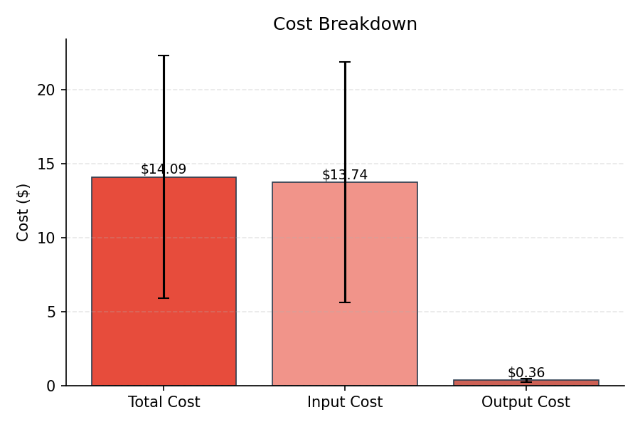
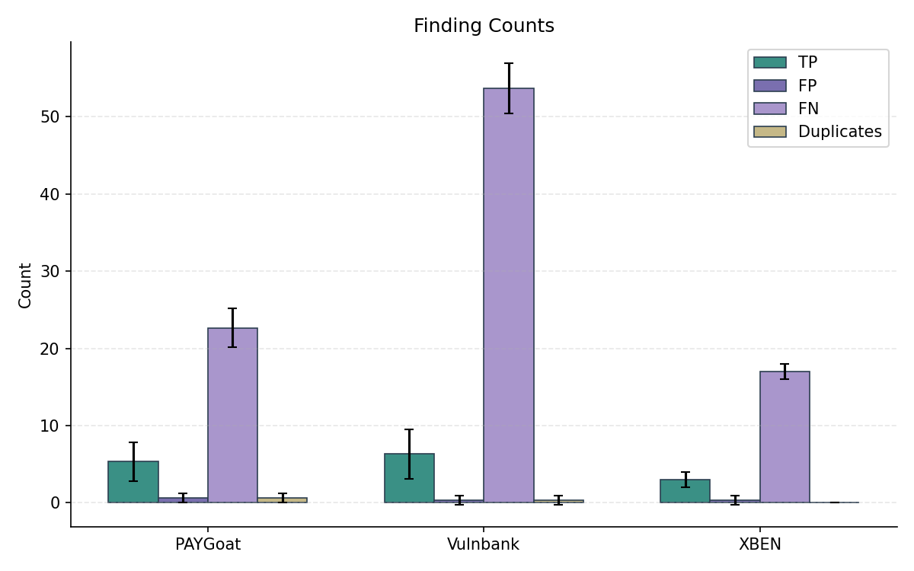
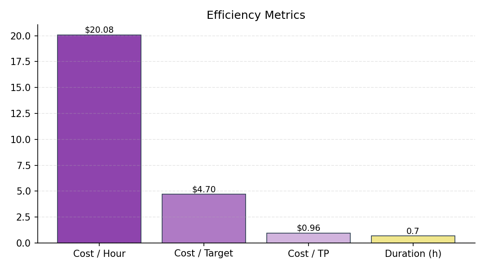
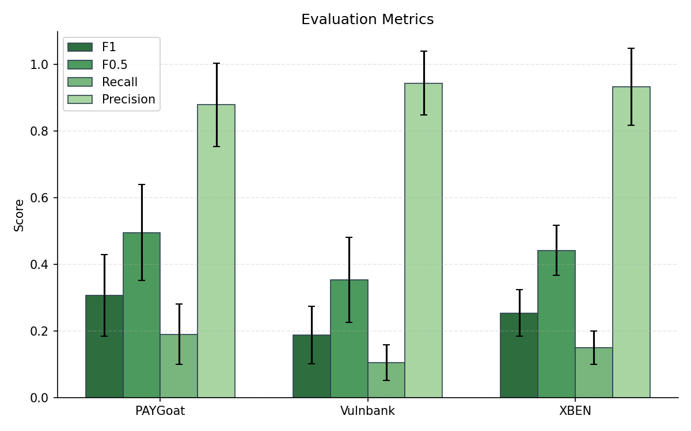
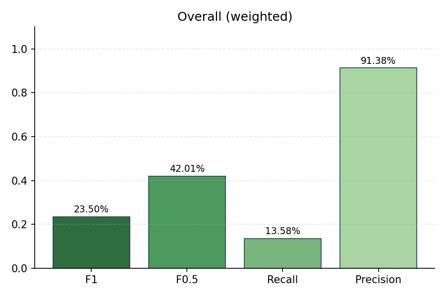
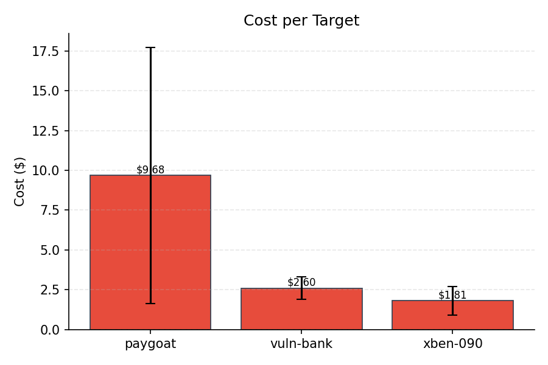
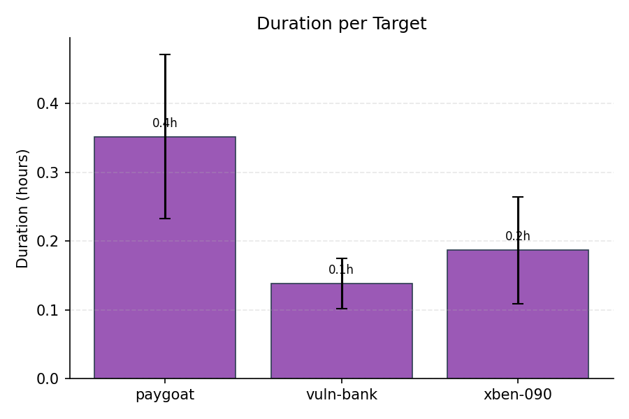
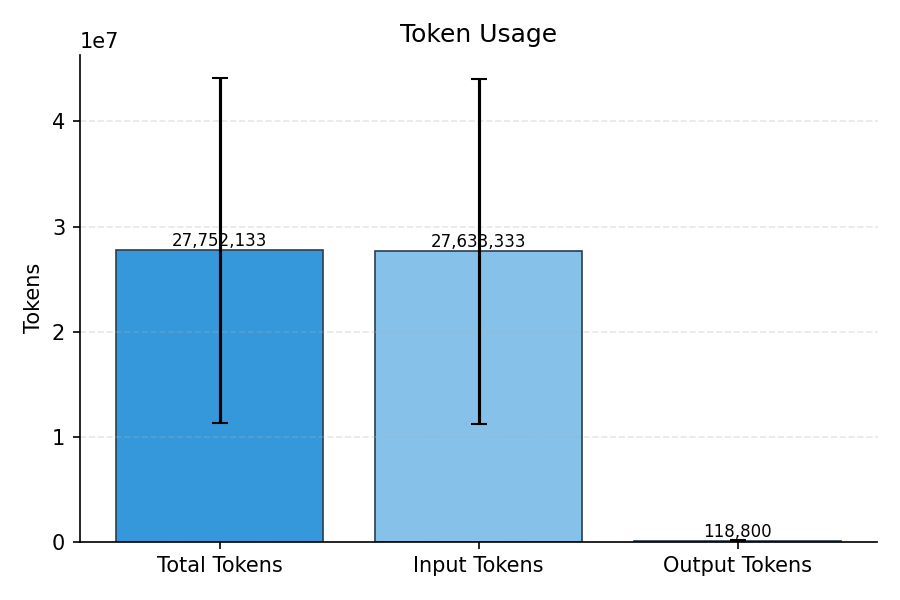

# Evaluation Summary

## Overall (unweighted)

| Metric | Value |
|--------|-------|
| Precision | 91.38% |
| Recall | 13.58% |
| F1 | 23.50% |
| F0.5 | 42.01% |
| Severity Score | 432.67 |

## Overall (weighted)

| Metric | Value |
|--------|-------|
| Precision | 91.38% |
| Recall | 13.58% |
| F1 | 23.50% |
| F0.5 | 42.01% |
| Severity Score | 144 |

## Per-Subset Results

| Subset | TP | FP | FN | DUP | Precision | Recall | F1 | F0.5 | Severity |
|--------|----|----|----|----|-----------|--------|----|----|------|
| PAYGoat | 5.33 | 0.67 | 22.67 | 0.67 | 87.96% | 19.05% | 30.77% | 49.56% | 163.33 |
| Vulnbank | 6.33 | 0.33 | 53.67 | 0.33 | 94.44% | 10.56% | 18.74% | 35.36% | 209.33 |
| XBEN | 3 | 0.33 | 17 | 0 | 93.33% | 15.00% | 25.42% | 44.20% | 60 |

## Cost & Token Metrics

| Metric | Value |
|--------|-------|
| Total Cost | $14.09 |
| Input Cost | $13.74 |
| Output Cost | $0.36 |
| Input Tokens | 27,633,333 |
| Output Tokens | 118,800 |
| Total Tokens | 27,752,133 |
| Duration | 0.7h |
| Cost / Hour | $20.08 |
| Cost / Target | $4.70 |
| Cost / TP | $0.96 |
| Runs | 3 |

## Per-Target Metrics

| Target | Cost | Tokens | Duration |
|--------|------|--------|----------|
| paygoat | $9.68 | 19,162,333 | 0.4h |
| vuln-bank | $2.60 | 5,032,833 | 0.1h |
| xben-090 | $1.81 | 3,556,967 | 0.2h |

## Plots

