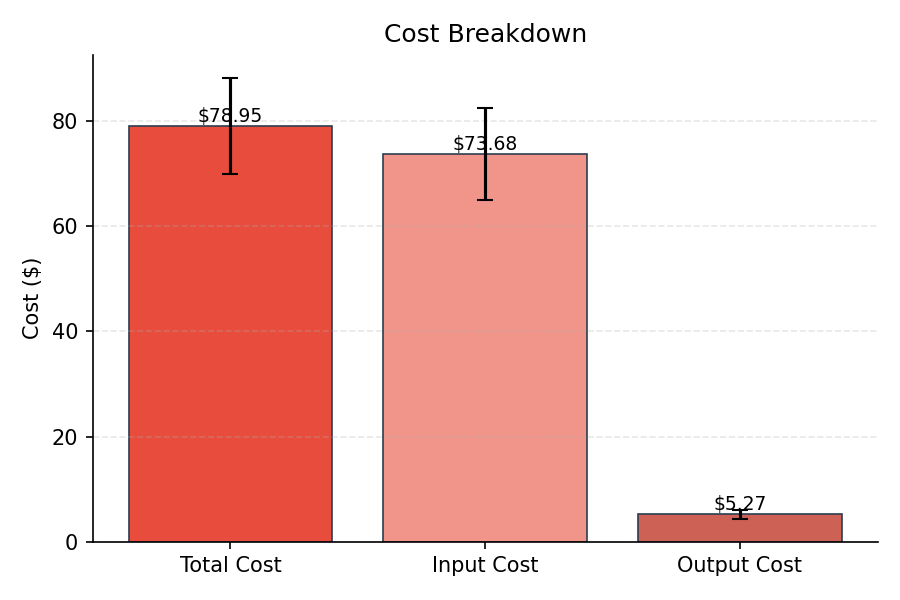
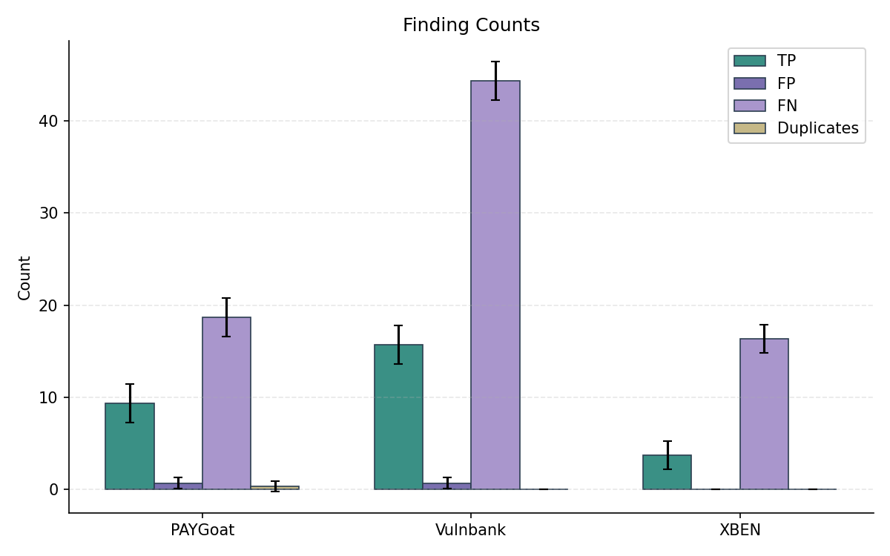
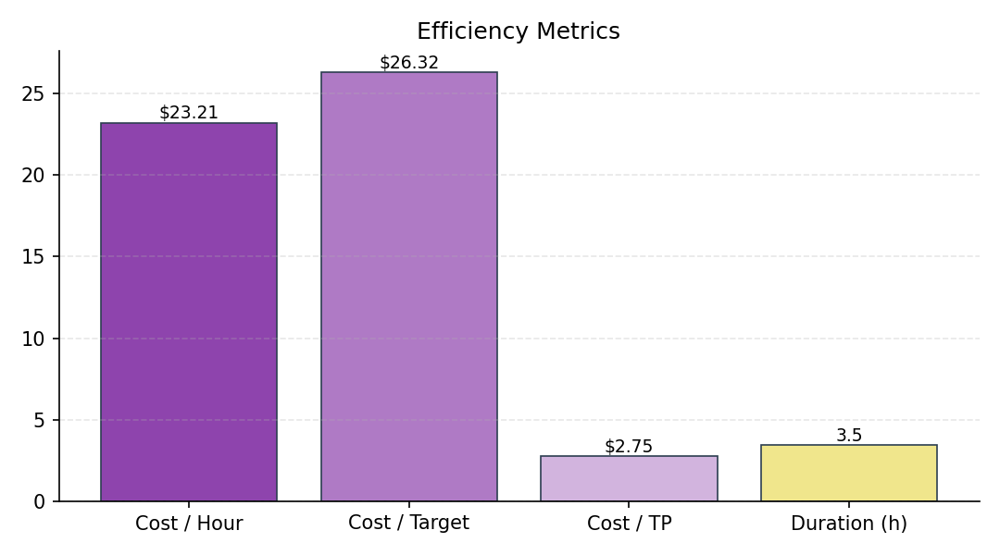
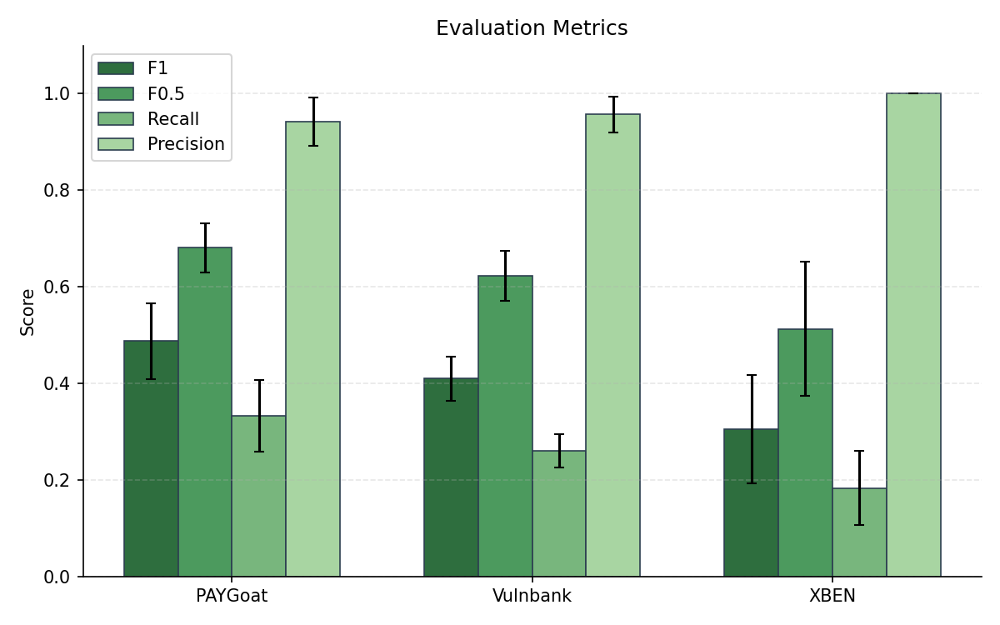
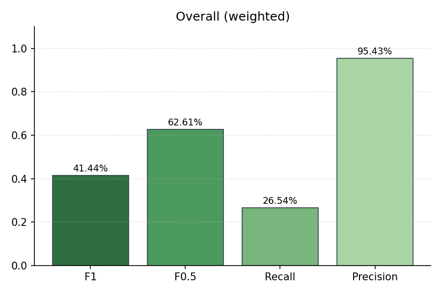
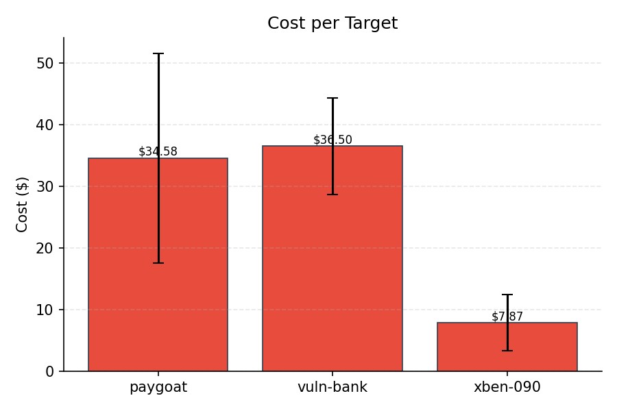
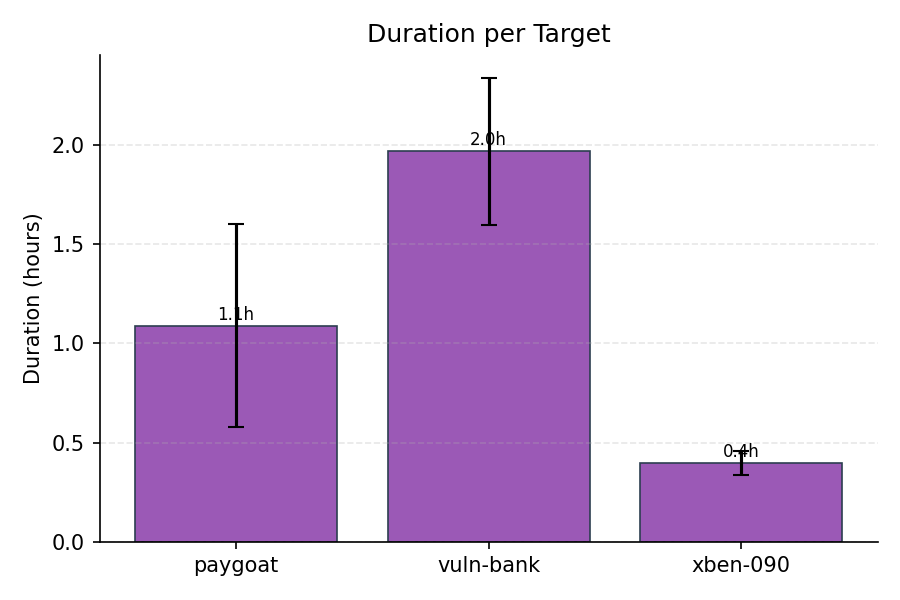
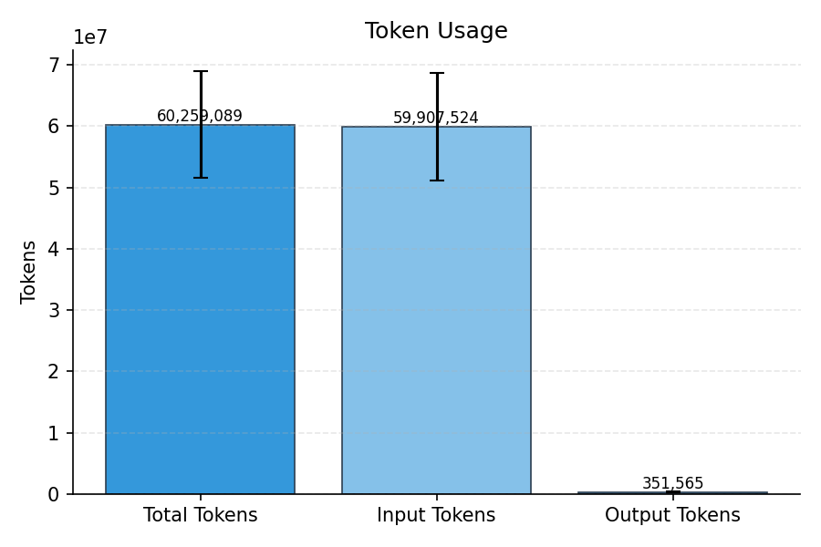

# Evaluation Summary

## Overall (unweighted)

| Metric | Value |
|--------|-------|
| Precision | 95.43% |
| Recall | 26.54% |
| F1 | 41.44% |
| F0.5 | 62.61% |
| Severity Score | 872 |

## Overall (weighted)

| Metric | Value |
|--------|-------|
| Precision | 95.43% |
| Recall | 26.54% |
| F1 | 41.44% |
| F0.5 | 62.61% |
| Severity Score | 290.67 |

## Per-Subset Results

| Subset | TP | FP | FN | DUP | Precision | Recall | F1 | F0.5 | Severity |
|--------|----|----|----|----|-----------|--------|----|----|------|
| PAYGoat | 9.33 | 0.67 | 18.67 | 0.33 | 94.19% | 33.33% | 48.76% | 68.10% | 323.33 |
| Vulnbank | 15.67 | 0.67 | 44.33 | 0 | 95.69% | 26.11% | 40.99% | 62.33% | 468.67 |
| XBEN | 3.67 | 0 | 16.33 | 0 | 100.00% | 18.33% | 30.51% | 51.26% | 80 |

## Cost & Token Metrics

| Metric | Value |
|--------|-------|
| Total Cost | $78.95 |
| Input Cost | $73.68 |
| Output Cost | $5.27 |
| Input Tokens | 59,907,524 |
| Output Tokens | 351,565 |
| Total Tokens | 60,259,089 |
| Duration | 3.5h |
| Cost / Hour | $23.21 |
| Cost / Target | $26.32 |
| Cost / TP | $2.75 |
| Runs | 3 |

## Per-Target Metrics

| Target | Cost | Tokens | Duration |
|--------|------|--------|----------|
| paygoat | $34.58 | 23,745,245 | 1.1h |
| vuln-bank | $36.50 | 29,028,744 | 2.0h |
| xben-090 | $7.87 | 7,485,100 | 0.4h |

## Plots

